{backmatter}

# Appendix A: Environment Setup Tutorials {#appendix-a}

This section is divided into 3 sections. The **Basic** section which provides the most basic ways of setting up your development environment for _Phaser_, the **Advanced** section which are for experienced developers who want a more comfortable environment at the price of complexity, and the **Cloud** section where we have tutorials on how to develop without requiring anything other than a browser and a stable internet connection.

## Basic Setup

Here's a basic step-by-step tutorial on preparing your system for the workshop:

1. Download the [basic game template](https://github.com/bryanbibat/html5shmup-template/archive/2.2-v1.zip) from Github and extract it into a folder.

    

2. Download either [version 2](http://www.sublimetext.com/2) or [beta version 3](http://www.sublimetext.com/3) of Sublime Text and install it in your computer.
3. In Sublime Text, add the folder you extracted to the current project by using `Project` -> `Add Folder to Project...`

    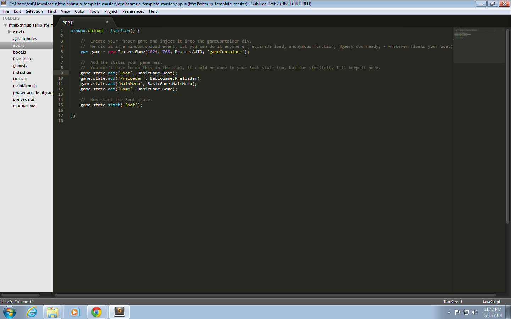

4. This last step, setting up a web server, will depend on your operating system:

    If you're using **Windows**, the smallest and easiest web server to setup is [Mongoose](http://cesanta.com/mongoose.shtml).

    If you're using a **Mac** or a **Linux** / **Unix** machine, the easiest is [Python](https://www.python.org/)'s `SimpleHTTPServer` since pretty much all of these OSs have Python pre-installed.

### Mongoose Setup

Repeating Mongoose's [tutorial](http://cesanta.com/docs/FileSharing.shtml): 

1. Download Mongoose Free Edition and copy it into the working folder.

    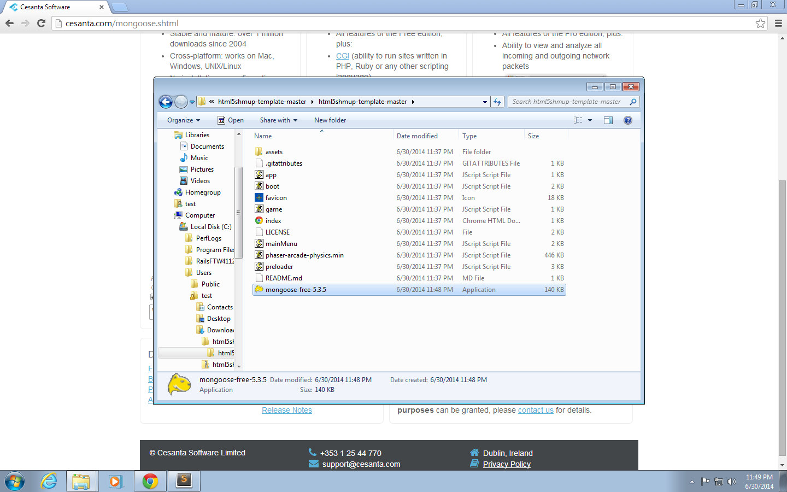

2. Run Mongoose. Unblock the firewall for Mongoose by clicking `Allow access`.

    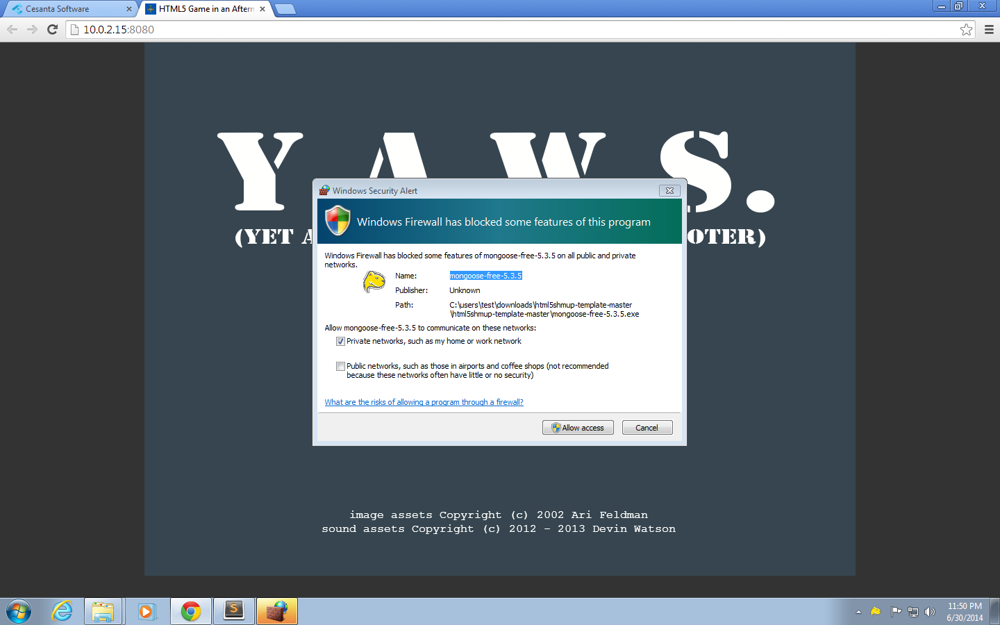

3. Your browser should now be open at the game template.

    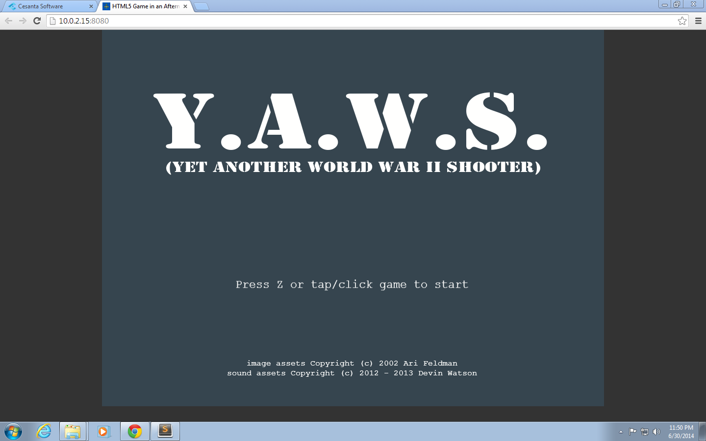

### Starting a Simple Python HTTP Server

1. Open your terminal and go to your working folder.
2. Run `python -m SimpleHTTPServer`.
3. Open your browser to [http://localhost:8000/](http://localhost:8000) to access your game.

    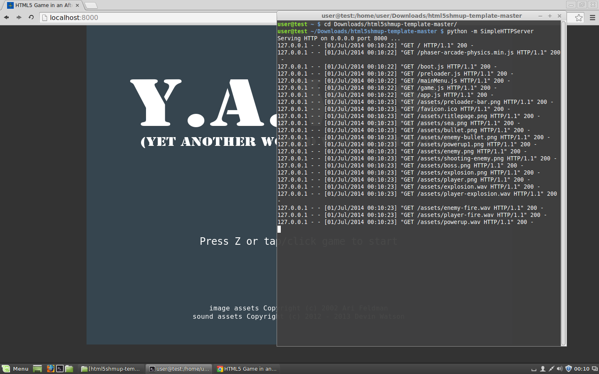
    
## Advanced Setup

Some experienced web developers might open the basic template and be disappointed at how plain it looks compared to the code they use in their day to day work. To answer this problem, I've made a couple of alternative templates that have the 2 features that I can't live without when developing front-ends: [LiveReload](http://livereload.com/) and a means for concatenating/minifying/preprocessing JS and CSS.

### JavaScript / NodeJS Template

You can find a starting template for NodeJS at the [`javascript` branch of the base template](https://github.com/bryanbibat/html5shmup-template/tree/javascript).

This template is a slightly modified version of Luke Wilde's [phaser-js-boilerplate](https://github.com/lukewilde/phaser-js-boilerplate) which uses Browserify, Jade, Stylus, Lodash, JsHint, Uglify.js, Google Analytics, Image optimisation tools, LiveReload, Zip compression, and partial cache busting for assets.

To setup:

{linenos=off,lang="text"}
~~~~~~~~
$ git clone https://github.com/bryanbibat/html5shmup-template.git
$ cd html5shmup-template
$ git checkout javascript
$ npm install
~~~~~~~~

Run [`grunt`](http://gruntjs.com/) (which you might have to install via `npm install -g grunt-cli`) to start server and open the default browser to [http://localhost:3017](http://localhost:3018). You can change the port settings in `src/js/game/properties.js`.

Run `grunt build` to compile everything (pre-process, concatenate, minify, etc.) to the `build` folder for production release.

Refer to the original boilerplate's Github Read Me for other details.

### Ruby Template

You can find a starting template for Ruby at the [`ruby` branch of the base template](https://github.com/bryanbibat/html5shmup-template/tree/ruby).

This template uses [Middleman](http://middlemanapp.com/) for features like LiveReload and Asset Pipeline. Compared to the NodeJS template, this template's set of libraries are more oriented towards the Ruby ecosystem: ERb and Haml instead of Jade, Sass instead of Stylus, and so on.

To setup:

{linenos=off,lang="text"}
~~~~~~~~
$ git clone https://github.com/bryanbibat/html5shmup-template.git
$ cd html5shmup-template
$ git checkout ruby
$ bundle install
~~~~~~~~

To start server:

{linenos=off,lang="text"}
~~~~~~~~
$ bundle exec middleman server
~~~~~~~~

Your game will be available at [http://localhost:4567](http://localhost:4567). Note that LiveReload is set up to work only for localhost, if you want to make it work on a different machine in the network, you must specify the host in `config.rb` e.g.

{linenos=off,lang="ruby"}
~~~~~~~~
 activate :livereload, host: 192.168.1.111
~~~~~~~~

To compile everything to the `build` folder:

{linenos=off,lang="text"}
~~~~~~~~
$ bundle exec middleman build
~~~~~~~~

Refer to the Middleman docs for other details.

Note that Middleman's Sprockets interface doesn't support audio so `audio_path` won't work. Check out `_preloader.js.erb` for my workaround.

## Cloud IDE Setup

Online IDEs like [Codio](https://codio.com/) and [Cloud9](https://c9.io/) serve as alternative to desktop/laptop-based development. They take away the hassle of having to install additional software on your computer and replace it with the hassle of finding a venue that has reliable internet - this can be a big problem for workshops.

We'll run through the steps of setting up two types development environment: one using Codio on the basic template, and another using Nitrous.IO on the advanced Ruby template.

### Codio + Basic Template

1. Sign-up for Codio by filling out the form at [https://codio.com/p/signup](https://codio.com/p/signup).
2. At the dashboard, click "Create Project". Fill out the Project Name and choose Git with the Git repo being the template, [https://github.com/bryanbibat/html5shmup-template.git](https://github.com/bryanbibat/html5shmup-template.git), then click the "Create Project" button.

    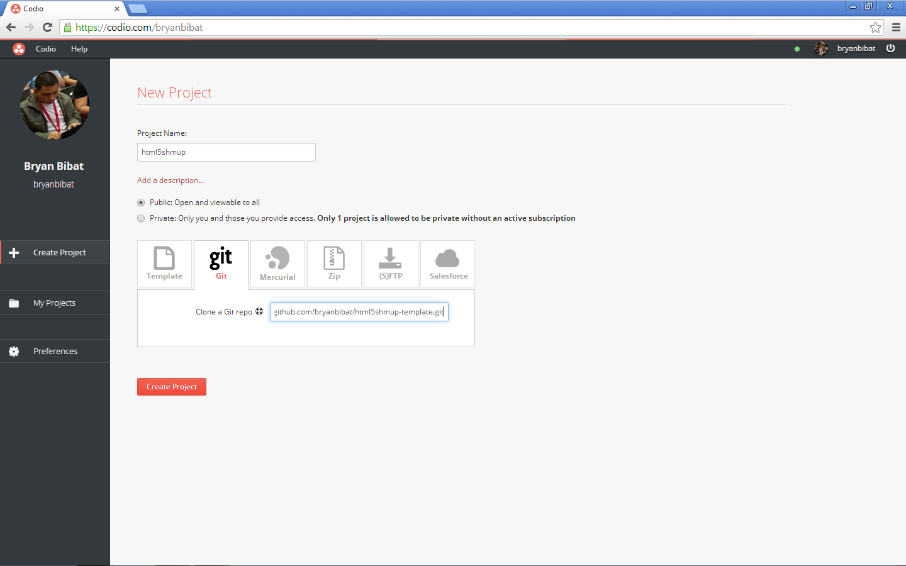

3. Wait until Codio finishes creating your project. You should be able to start editing your files once that is done.

    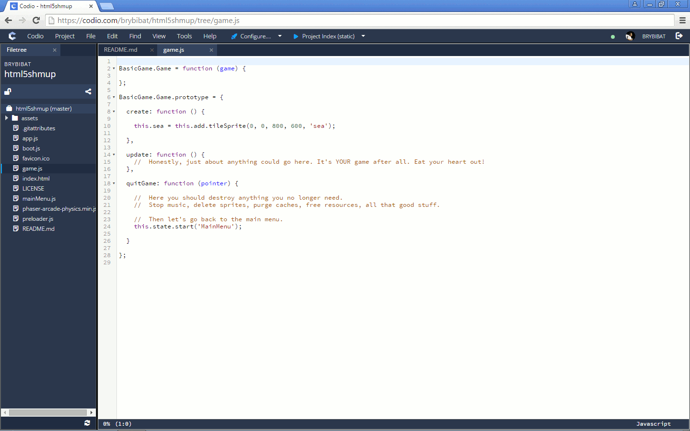

4. Click the "> Project Index (static)" button/link at the header to open your game in a new tab. You can also access your game by opening the URL shown in another browser tab or window.

    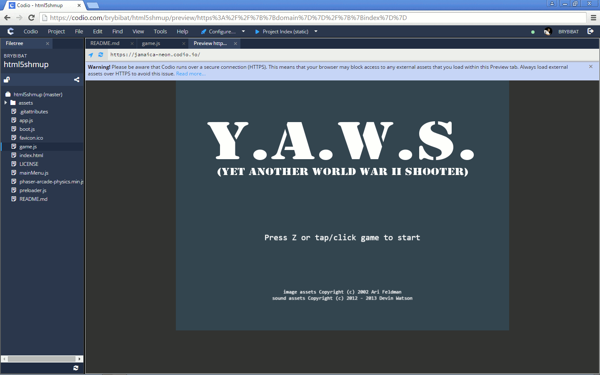

### Cloud9 + NodeJS Template

1. Sign-up for Cloud9 by filling out the form at [https://c9.io/web/sign-up/free](https://c9.io/web/sign-up/free).

2. At the dashboard, click "Create a new workspace". Fill out the details and the Git URL, choose the "Node.js" template, and click the "Create Box" button. Leave the Github repository blank. 

    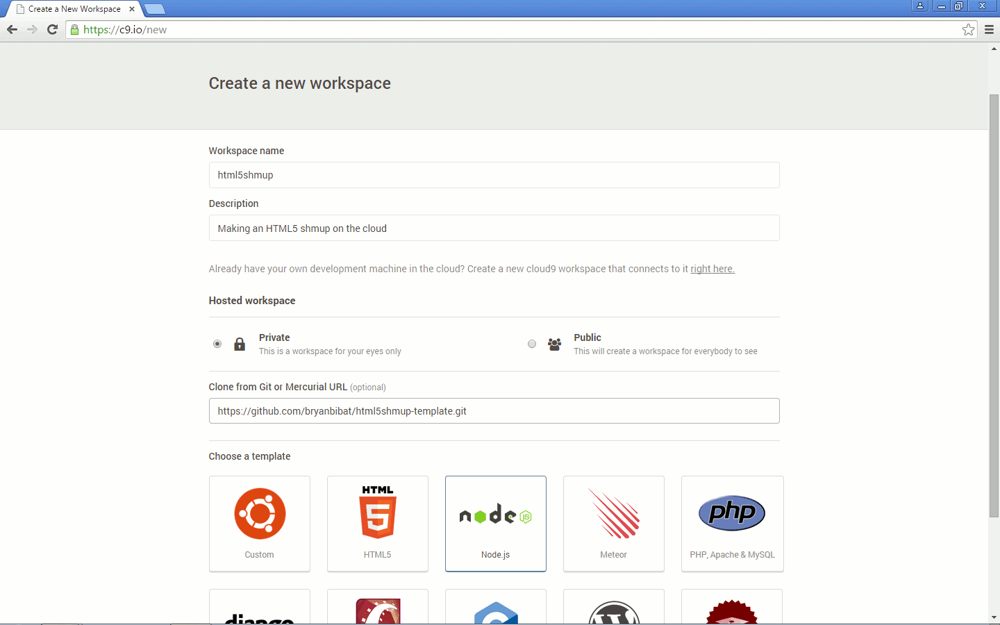

3. Wait until Cloud9 finishes creating your project. Once that is done, go to the bash console at the bottom and checkout the `javascript` branch then install the required modules:

    {linenos=off,lang="text"}
    ~~~~~~~~
    $ git checkout javascript
    $ npm install -g grunt-cli
    $ npm install
    ~~~~~~~~

    You can also choose your preferences at the Welcome screen while the installation is in progress.

    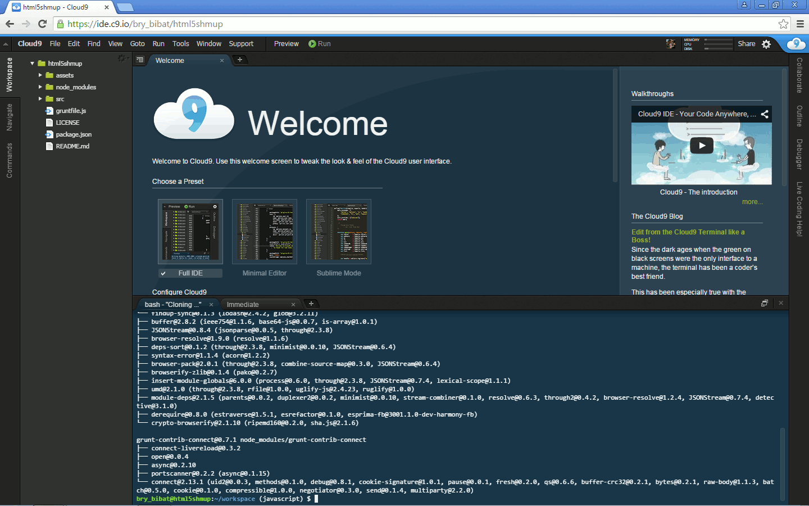

4. To view our app, Cloud9 directs traffic to one port and IP address defined by the `PORT` and `IP` env variables respectively. Open `gruntfile.js`, modify the `connect` options accordingly, then run `grunt --force` to start the app and ignore the `grunt-open` error:

    {linenos=off,lang="js"}
    ~~~~~~~~
    connect: { 
      dev: {
        options: {
    leanpub-start-delete
          port: '<%= project.port %>',
    leanpub-end-delete
    leanpub-start-insert
          port: process.env.PORT,
          hostname: process.env.IP,
    leanpub-end-insert
          base: './build'
        }
      }
    },
    ~~~~~~~~

    

5. Open "Preview -> Preview Running Application" to open your game in a new window.

    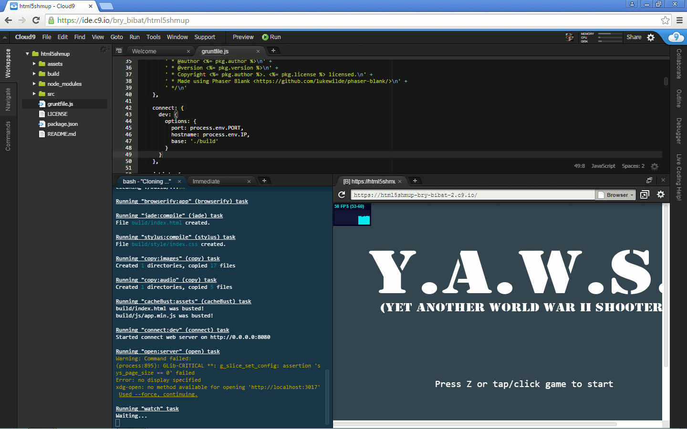

    You can also press the "Pop Out Into New Window" button to open the preview in a new tab.

You can now edit your files and make your game. Unfortunately since Cloud9 only opens one port, LiveReload will not refresh the game automatically upon saving.

# Appendix B: Expected Code Per Chapter

We understand that there are cases you need to "cheat" and need to look for the "correct" code after each chapter. 

Maybe you've been spending too much time trying to find where you mistyped the code. Maybe a participant had to leave the workshop for 1 hour to deal with an emergency.

Regardless of the reason, here are the working code for each chapter of the workshop.

* **Overview of the Starting Code** - [Browse in Github](https://github.com/bryanbibat/html5shmup-template/tree/ddd94132bbb8a53d127f7975b74a27c909900a77), [Download Zip](https://github.com/bryanbibat/html5shmup-template/archive/ddd94132bbb8a53d127f7975b74a27c909900a77.zip)
* **Sprites, the Game Loop, and Basic Physics** - [Browse in Github](https://github.com/bryanbibat/html5shmup-template/tree/cd1f530ae3f1e86798bfe0157cbb3d02280fe272), [Download Zip](https://github.com/bryanbibat/html5shmup-template/archive/cd1f530ae3f1e86798bfe0157cbb3d02280fe272.zip)
* **Player Actions** - [Browse in Github](https://github.com/bryanbibat/html5shmup-template/tree/abd7525430a1055cd2b8b2112df25f67793bc714), [Download Zip](https://github.com/bryanbibat/html5shmup-template/archive/abd7525430a1055cd2b8b2112df25f67793bc714.zip)
* **Object Groups** - [Browse in Github](https://github.com/bryanbibat/html5shmup-template/tree/ed733b5f7fd6ff6fccbbdb31d317ed9f80b7a2ee), [Download Zip](https://github.com/bryanbibat/html5shmup-template/archive/ed733b5f7fd6ff6fccbbdb31d317ed9f80b7a2ee.zip)
* **Refactoring** - [Browse in Github](https://github.com/bryanbibat/html5shmup-template/tree/43415871375285d067abcc1880695f77f2c0cbb0), [Download Zip](https://github.com/bryanbibat/html5shmup-template/archive/43415871375285d067abcc1880695f77f2c0cbb0.zip)
* **Health, Score, and Win/Lose Conditions** - [Browse in Github](https://github.com/bryanbibat/html5shmup-template/tree/a55130376d734274c729baa7295150f3a7553a93), [Download Zip](https://github.com/bryanbibat/html5shmup-template/archive/a55130376d734274c729baa7295150f3a7553a93.zip)
* **Expanding the Game** 
  * **Harder Enemy** - [Browse in Github](https://github.com/bryanbibat/html5shmup-template/tree/2f9209428b6030c04642848309950bc730200c13), [Download Zip](https://github.com/bryanbibat/html5shmup-template/archive/2f9209428b6030c04642848309950bc730200c13.zip)
  * **Power-up** - [Browse in Github](https://github.com/bryanbibat/html5shmup-template/tree/91dfb5a97f5beab78849d1d8ad58564354a4a674), [Download Zip](https://github.com/bryanbibat/html5shmup-template/archive/91dfb5a97f5beab78849d1d8ad58564354a4a674.zip)
  * **Boss Battle** - [Browse in Github](https://github.com/bryanbibat/html5shmup-template/tree/9d6729f51cb6c8659f0ed6cb7fa4d0f7b22730f1), [Download Zip](https://github.com/bryanbibat/html5shmup-template/archive/9d6729f51cb6c8659f0ed6cb7fa4d0f7b22730f1.zip)
  * **Sound Effects** - [Browse in Github](https://github.com/bryanbibat/html5shmup-template/tree/53234cfd05c803450a33727719e0afbb3e26dd90), [Download Zip](https://github.com/bryanbibat/html5shmup-template/archive/53234cfd05c803450a33727719e0afbb3e26dd90.zip)
* **Wrapping Up**
  * **Restore original game flow** - [Browse in Github](https://github.com/bryanbibat/html5shmup-template/tree/2b1190f0b13ae3544903eac97442784d5c7af09b), [Download Zip](https://github.com/bryanbibat/html5shmup-template/archive/2b1190f0b13ae3544903eac97442784d5c7af09b.zip)
  * **Sharing your game** - [Browse in Github](https://github.com/bryanbibat/html5shmup-template/tree/afcfd3d216c540055c049b5c4447d2cbf103224e), [Download Zip](https://github.com/bryanbibat/html5shmup-template/archive/afcfd3d216c540055c049b5c4447d2cbf103224e.zip)

To make sure the lazy people don't cheat all the way, we won't provide links to solutions for the [_Challenges_](#challenges).
