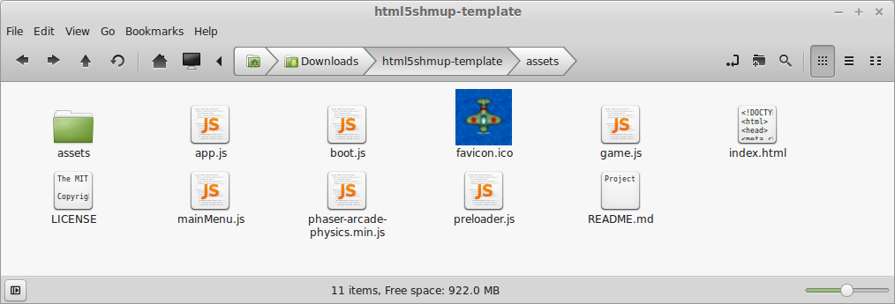
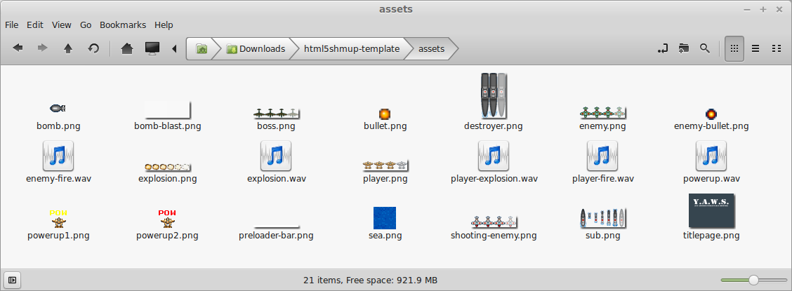

# Afternoon 0: Overview of the Starting Code {#base-template}

By now you should have finished setting up your development environment, with your web server up and your editor open to the folder containing the base code for the tutorial. If not, please refer again to the [Development Environment Setup](#dev-setup) in previous chapter.

Before we proceed to the actual tutorial, let's take a tour of the starter template:

This template is based on the Basic Game Template found in the `resources/Project Templates` folder of the [_Phaser_ Git repository](https://github.com/photonstorm/phaser/tree/master/resources/Project%20Templates). We're using this because it follows a more modular approach compared to most of the _Phaser Examples_ and therefore much closer to real-life apps. 

Let's do a quick run-through of the files:

* `index.html` - our main HTML5 page that links all our files together. There's not much to say about this except for the `

` which _Phaser_ will use to draw the Canvas on to.
* `phaser-arcade-physics.min.js` - _Phaser_ stripped of 2 other physics engines (retaining only "Arcade" physics) and minified. You can replace this later on with the full version if you plan to use the other physics engines or if you want to the refer to the original code while developing.
* `app.js` - the code that kicks off the app. Creates the `Phaser.Game` object and adds the `States`.
* `boot.js`, `preloader.js`, `mainMenu.js`, `game.js` - the different states of our game, combined together by `app.js` to form the flow of our app:
  * **Boot** - The initial state. Sets up additional settings for the game. Also pre-loads the image for the pre-loader progress bar before passing the game to **Preloader**.
  * **Preloader** - Loads all assets before the actual game. Once that's done, the game proceeds to **MainMenu**.
  * **MainMenu** - The title screen and main menu before the actual game.
  * **Game** - The actual game.

Reading through the JS files and the comments within will give you a peek of what to expect from _Phaser_.

The template also includes all the necessary sprites and sounds for the basic game, saving you hours of looking for or making your own game assets. The sprites were taken from Ari Feldman's open-sourced sprite compilation [SpriteLib](http://www.widgetworx.com/spritelib/) while the sounds were from [Devin Watson's OpenGameArt.org portfolio](http://opengameart.org/users/dklon).

With the code tour out of the way, we can now move on to the tutorial.

A> ## Code Examples
A> 
A> You will see sample code throughout this manual. The text decoration in the code will tell you what you need to do to the existing code.
A> 
A> For example, let's modify `game.js` to make the background scroll vertically:
A> 
A> {linenos=off,lang="js"}
A> ~~~~~~~~
A> update: function () {
A> {leanpub-start-delete}
A>   //  Honestly, just about anything could go here. It's YOUR game after all...
A> {leanpub-end-delete}
A> {leanpub-start-insert}
A>   this.sea.tilePosition.y += 0.2;
A> {leanpub-end-insert}
A> },
A> ~~~~~~~~
A> 
A> In the code example above, there is a strikethrough on the comment. Strikethrough means you need to delete those lines. On the other hand, the following line is in **boldface**, which means you need to insert those lines at that position.
A>
A> Some examples for inserting functions will also have line numbers to tell you where to insert those functions. They will also give you an idea if you've properly added the code up to that point.

A> ## Skipping Main Menu
A> 
A> We'll be modifying our code many times throughout this tutorial. Skipping the boot, pre-loading, and main menu in order to go directly to our game, will save us a click after the refresh every time we make a change. To skip those states, change the starting state in `app.js`:
A> 
A> {linenos=off,lang="js"}
A> ~~~~~~~~
A> {leanpub-start-delete}
A>   game.state.start('Boot');
A> {leanpub-end-delete}
A> {leanpub-start-insert}
A>   game.state.start('Game');
A> {leanpub-end-insert}
A> ~~~~~~~~
A> 
A> And since we're skipping the `preloader.js`, we'll copy over the sea background asset loading to `game.js`:
A> 
A> {linenos=off,lang="js"}
A> ~~~~~~~~
A> BasicGame.Game.prototype = {
A> {leanpub-start-insert}
A>   preload: function () {
A>     this.load.image('sea', 'assets/sea.png');
A>   },
A>
A> {leanpub-end-insert}
A>   create: function () {
A> ~~~~~~~~

A> ## WebGL lag workaround
A> 
A> _Phaser_ automatically detects if your browser supports [WebGL](http://en.wikipedia.org/wiki/WebGL) and will use it if possible.
A> 
A> While it usually translates to faster performance on devices with graphics processors, WebGL rendering can be slow and laggy on other machines. If you're noticing significant lag on your browser, you can force _Phaser_ to use plain HTML Canvas by changing the following line in `app.js` :
A> 
A> {linenos=off,lang="js"}
A> ~~~~~~~~
A> {leanpub-start-delete}
A>   var game = new Phaser.Game(800, 600, Phaser.AUTO, 'gameContainer');
A> {leanpub-end-delete}
A> {leanpub-start-insert}
A>   var game = new Phaser.Game(800, 600, Phaser.CANVAS, 'gameContainer');
A> {leanpub-end-insert}
A> ~~~~~~~~
