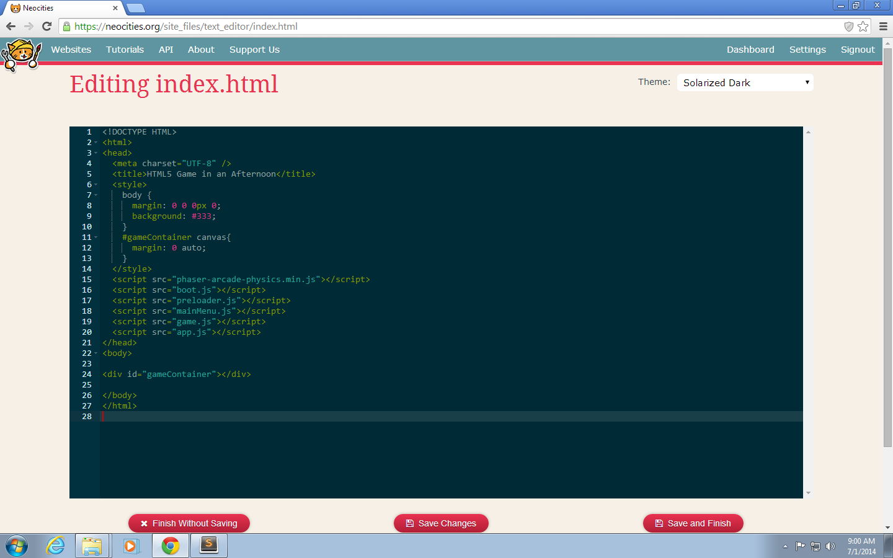
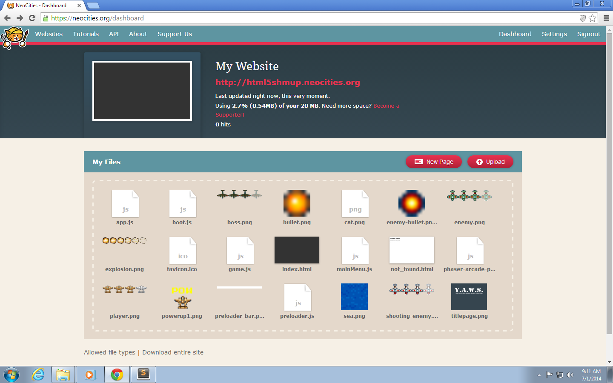
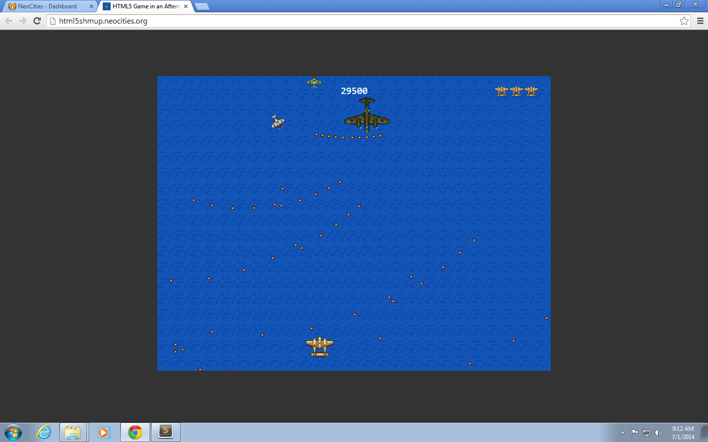

# Afternoon 6: Wrapping Up

We need to do one last thing before we unleash our game to the public.

## Restore original game flow

At the start of the tutorial, we modified our game to skip directly to the `Game` state. Now that the game's done, we'll need restore it to its original flow that we discussed in [Afternoon 0](#base-template). 

Let's start by deleting the `preload()` function in `game.js`:

{linenos=off,lang="js"}
~~~~~~~~
BasicGame.Game.prototype = {
{leanpub-start-delete}
  preload: function () {
    this.load.image('sea', 'assets/sea.png');
    this.load.image('bullet', 'assets/bullet.png');
    this.load.image('enemyBullet', 'assets/enemy-bullet.png');
    this.load.image('powerup1', 'assets/powerup1.png');
    this.load.spritesheet('greenEnemy', 'assets/enemy.png', 32, 32);
    this.load.spritesheet('whiteEnemy', 'assets/shooting-enemy.png', 32, 32);
    this.load.spritesheet('boss', 'assets/boss.png', 93, 75);
    this.load.spritesheet('explosion', 'assets/explosion.png', 32, 32);
    this.load.spritesheet('player', 'assets/player.png', 64, 64);
    this.load.audio('explosion', ['assets/explosion.ogg', 'assets/explosion.wav']);
    this.load.audio('playerExplosion',
                    ['assets/player-explosion.ogg', 'assets/player-explosion.wav']);
    this.load.audio('enemyFire', 
                    ['assets/enemy-fire.ogg', 'assets/enemy-fire.wav']);
    this.load.audio('playerFire', 
                    ['assets/player-fire.ogg', 'assets/player-fire.wav']);
    this.load.audio('powerUp', ['assets/powerup.ogg', 'assets/powerup.wav']);
  },
{leanpub-end-delete}
 
  create: function () {
~~~~~~~~

Do the same for `mainMenu.js`:

{linenos=off,lang="js"}
~~~~~~~~
BasicGame.MainMenu.prototype = {

{leanpub-start-delete}
  preload: function () {
    this.load.image('titlepage', 'assets/titlepage.png');
  },
{leanpub-end-delete}

  create: function () {
~~~~~~~~

Revert the starting state in `app.js` to `Boot`:

{linenos=off,lang="js"}
~~~~~~~~
  //  Now start the Boot state.
{leanpub-start-delete}
  game.state.start('Game');
{leanpub-end-delete}
{leanpub-start-insert}
  game.state.start('Boot');
{leanpub-end-insert}
~~~~~~~~

And before we forget, let's destroy the sprites that we added in the previous chapter when we quit the game:

{linenos=off,lang="js"}
~~~~~~~~
  quitGame: function (pointer) {

    //  Here you should destroy anything you no longer need.
    //  Stop music, delete sprites, purge caches, free resources, all that good stuff.
    this.sea.destroy();
    this.player.destroy();
    this.enemyPool.destroy();
    this.bulletPool.destroy();
    this.explosionPool.destroy();
{leanpub-start-insert}
    this.shooterPool.destroy();
    this.enemyBulletPool.destroy();
    this.powerUpPool.destroy();
    this.bossPool.destroy();
{leanpub-end-insert}
    this.instructions.destroy();
    this.scoreText.destroy();
    this.endText.destroy();
    this.returnText.destroy();
    //  Then let's go back to the main menu.
    this.state.start('MainMenu');

  }
~~~~~~~~

## Sharing your game

The good thing about HTML5 games is that it's no different from a typical static HTML web site: if you want to share your game to the world, all you need to do is find a web server, upload your files there, and access the server through your browser.

If you used a cloud IDE like Codio or Nitrous.IO for this tutorial, you don't need to do anything -- you can just share the preview URL you used when you developed your game. If you developed locally, however, you'll need to decide from the thousands of web hosting solutions out there to host your game. 

The only free hosting solution I can recommend right now is [Github Pages](https://pages.github.com/). Most of the alternatives are either seedy ad-infested sites or free-tier cloud solutions (e.g. AWS, Azure) that require a bit of tinkering just to serve our game. 

Unfortunately, Github Pages is not as easy as "drag-and-drop"; you still need to know Git before you can use. So for the sake of those who aren't experienced web developers, we'll be using the simplest free static web hosting out there that doesn't bombard you with ads: [Neocities](https://neocities.org/).

### Steps for deploying to Neocities

Neocities has a straightforward sign-up page and a simple drag-and-drop interface making it easy even for beginners. There are some caveats, though:

* Neocities doesn't support folders
* Neocities doesn't allow you to upload `.wav` files

Taking these into account, here are the steps to using Neocities to host your game:

1. **Remove all audio** - Remove all of the `load.audio()` calls in `preloader.js` and the `add.audio()` and `audio.play()` calls in `game.js`. Refer to the previous chapter to find their locations.

2. **Update asset locations** - Move all images from the assets folder to the root then update all of the references in `boot.js` and `preloader.js` to point to the correct location i.e.

    {linenos=off,lang="js"}
    ~~~~~~~~
      preload: function () {

        //  Here we load the assets required for our preloader (in this case a loading bar)
        this.load.image('preloaderBar', 'preloader-bar.png');

      },
    ~~~~~~~~
    
    {linenos=off,lang="js"}
    ~~~~~~~~
      preload: function () {
        this.load.image('titlepage', 'titlepage.png');
        this.load.image('sea', 'sea.png');
        this.load.image('bullet', 'bullet.png');
        this.load.image('enemyBullet', 'enemy-bullet.png');
        this.load.image('powerup1', 'powerup1.png');
        this.load.spritesheet('greenEnemy', 'enemy.png', 32, 32);
        this.load.spritesheet('whiteEnemy', 'shooting-enemy.png', 32, 32);
        this.load.spritesheet('boss', 'boss.png', 93, 75);
        this.load.spritesheet('explosion', 'explosion.png', 32, 32);
        this.load.spritesheet('player', 'player.png', 64, 64);
      }
    ~~~~~~~~

3. **Sign-up for Neocities** - Fill up the form at [https://neocities.org/new](https://neocities.org/new).
4. **Overwrite index.html** - Replace its contents with your `index.html`.

    

5. **Upload the game files** - Drag and drop all of the `.js` and `.png` files as well `favicon.ico` to the files box. If dragging multiple files doesn't work, upload them one by one.

    

6. **Verify the game works by opening the site** - If all goes well, you should now see your game (sans sound).

    
