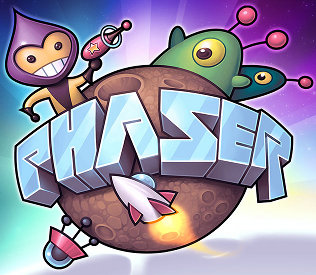

{mainmatter}

# Introduction

This is usually the part where books give a lengthy intro about HTML5 to increase their word count. This is not one of those books.

All you need to know about HTML5 is that it allows you to do stuff in your browser, regardless if it's on a desktop PC or a mobile phone, without the need for extra plugins. And that includes making games. If you want a better intro to HTML5, head over to [Dive Into HTML5](http://diveintohtml5.info/). 

As the title and cover of the book implies, we will introduce you to both HTML5 and game development by guiding you in making a shoot-em-up game similar to the classic video game [1942](http://en.wikipedia.org/wiki/1942_(video_game)).

There are a number of HTML5 libraries and frameworks out there right now. For this afternoon workshop, we'll be using [**Phaser**](http://phaser.io), an open-source framework built on top of [Pixi.js](http://www.pixijs.com). It's a higher-level framework: it's bigger and may feel like you have much less control (i.e. _magical_) compared to other frameworks, but at the same time, you need far less code to get things done and this makes it suitable for a short workshop such as this one.

## Who is this book for?

This book is for people who want to learn the basic concepts behind creating games. As a workshop manual, it is also for experienced developers interested in introducing those concepts to those people. With these in mind, here are some possible setups for using _HTML5 Shoot 'em Up in and Afternoon_:

* **Self-study** - AKA your run-of-the-mill tutorial where you just go through the book from cover-to-cover. Web developers with extensive experience in JavaScript will find the code in this book easy and fairly straightforward. Novice programmers might not get the same pleasant experience, especially those who have not yet coded in JS enough to understand its quirks.

* **Pair or Small-group Study** - Spend an afternoon teaching game programming to your daughter / cousin / nephew. It's recommended to go through the book once or twice beforehand to make sure things go smoothly. (Unless of course you want to expose the kid to the reality of "spend minutes or hours looking for the copy-paste typo" software development.)

* **Workshop** - What this book was originally written for. Gather a group of people interested in making games in HTML5 and go through the tutorial at a slower pace. An experienced instructor (i.e. worked with _Phaser_ for some time, gone through the tutorial multiple times) can lead a workshop of 20 without a hitch, but for larger groups or groups with less programming experience, you may need to get a few extra mentors to help. 

# Morning: Preparing for the Afternoon

For instructors tutoring children or other individuals with little programming or even gaming experience, we recommended spending a few hours in the morning to make sure things go smoothly in the afternoon.

If you're the student, it's best you skip this part so as not to spoil what your teacher is going to ask you to do.

## Introduce them to Shoot 'em Ups

It may sound weird for us who grew up in the '80s and '90s where shoot 'em ups were staple arcade games, but there is a very slight possibility that the person you're teaching may not be familiar with the genre. 

If that's the case, then you need to let them play a few shoot 'em ups before starting the workshop. They must first understand the basic concepts around the genre, knowing what makes those games fun an challenging. At the worst case, finding out that they hate the genre will let you end the session early and spare you from an unproductive afternoon.

An obvious choice would be _1942_, as it has been ported and remade so many times that you can find one on pretty much any platform.

Then there are Flash games from sites like [Newgrounds](http://www.newgrounds.com/games/browse/tag/shmup#sort:score) and [Kongregate](http://www.kongregate.com/shooter-games). As HTML5 is supposed to replace Flash, letting your student play these games will give them an idea on what they can make in the future.

Steam also has a [good collection of shmups](http://store.steampowered.com/tag/en/Shmup/). [Jamestown](http://store.steampowered.com/app/94200/) deserves special mention because it lets you play with your students via local co-op.

## Technical Requirements: JavaScript and Math

Theoretically, you _can_ conduct a workshop with students who have no prior knowledge of JavaScript. They will be at the mercy of the copy-paste gods however, and it's also safe to say that they won't retain much after this workshop is over.

For best results, students who aren't familiar with programming or JavaScript must take a crash course in the morning. You don't need to go all the way into advanced JavaScript - knowing how to make and use functions and objects as well as using browser's developer consoles for debugging should be enough for the workshop. [MDN](https://developer.mozilla.org/en-US/docs/Web/Tutorials) has a good list of JavaScript tutorials that you and your students can choose from for this purpose.

In addition to programming skills, students should know basic Trigonometry. _Phaser_ already handles most of the calculation but knowing stuff like sine/cosine and polar coordinates will make it easier for them to visualize what's going on under the hood. They will also directly use those concepts at the latter part of the workshop where we rotate sprites and generate patterns for the boss battle.

While there are many online tutorials out there for trigonometry ([Khan Academy](https://www.khanacademy.org/math/trigonometry/basic-trigonometry) comes to mind), I have yet to see one that is better than your usual high school trigonometry class while accessible to younger students. You might even say that the other way around, introducing kids to trigonometry through game concepts, would be a better approach[^basic]. 

If you still wish to quickly introduce basic trigonometry to your students before the workshop, look for visually impressive and interactive demos like [_How to Fold a Julia Fractal_](http://acko.net/blog/how-to-fold-a-julia-fractal/).

[^basic]: True story: I discovered sine and cosine as way to make things spin or bob up and down back when I was a kid playing around with BASIC, two years before I had trigonometry class.

## Development Environment Setup {#dev-setup}

All you need to code in _Phaser_ is a browser that supports HTML5 (e.g. [Chrome](https://www.google.com/intl/en/chrome/browser/), [Firefox](http://www.mozilla.org/en-US/firefox/new/)), a web server, and the text editor of your choice. 

You _have_ to use a web server to test your game in this tutorial. The first part of [_Getting Started With Phaser_](http://www.phaser.io/getting-started-js.php) explains why this is the case.

As for the text editor, any editor or IDE with JavaScript support (syntax highlighting, automatic indent/brackets) and can parse non-Windows line endings (i.e. not Notepad) will do. If your preferred editor does not fit these requirements, we suggest downloading the free trial of [Sublime Text](http://www.sublimetext.com/).

Once you have setup your web server and text editor, download the [basic game template with _Phaser_ 2.4](https://github.com/bryanbibat/html5shmup-template/archive/2.4-dev.zip) from Github, extract it to the folder served by the web server, and start coding.

More detailed information about setting up your development environment (like choosing a web server) can be found at [_Appendix A: Environment Setup Tutorials_](#appendix-a).

## Other Suggested Prior Reading

Apart from JS and Math, we suggest that you at least skim through the following to give you an idea about what we are going to do:

* [**Getting Started with Phaser**](http://phaser.io/getting-started-js.php) - Phaser's own guide setting up a development environment
* [**Phaser Examples**](http://examples.phaser.io/) - view demos of Phaser's features.
* [**Phaser Documentation**](http://phaser.io/docs/) - your typical API docs with link to source.

In addition to Phasers documentation, the following may give you insights on making games in Phaser:

* [**Game Programming Patterns**](http://gameprogrammingpatterns.com/) - like many game frameworks, Phaser uses the _Game Loop_ pattern at its core.
* [**Game Mechanic Explorer**](http://gamemechanicexplorer.com/) - a somewhat short list of game mechanics, all implemented in Phaser.

## Video Walkthrough

This book reached the Leanpub's "Lifetime Number of Copies Sold" bestsellers list around December 2014. As my holiday gift of thanks to those that bought and downloaded it, I recorded a quick and dirty video walkthrough of the main chapters of the book. If you prefer watching the programming lessons in HD video (even when they are taught by a slightly drunk non-native English speaking guy), you're in luck.

If you purchased or downloaded the book, you should be able to download the videos (all 600MB+ of them) via the "Extras" zip link on your [Leanpub dashboard](https://leanpub.com/dashboard). If you're reading this online or want to watch in lower resolution, you can also [watch the videos on YouTube](https://www.youtube.com/playlist?list=PL0mVjsUoElSGbxaNmkOW6ZxwPcQm-_hwl).
