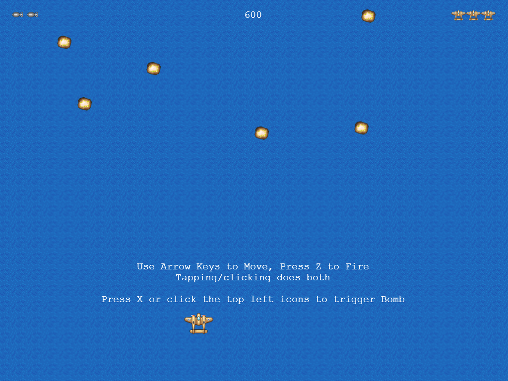
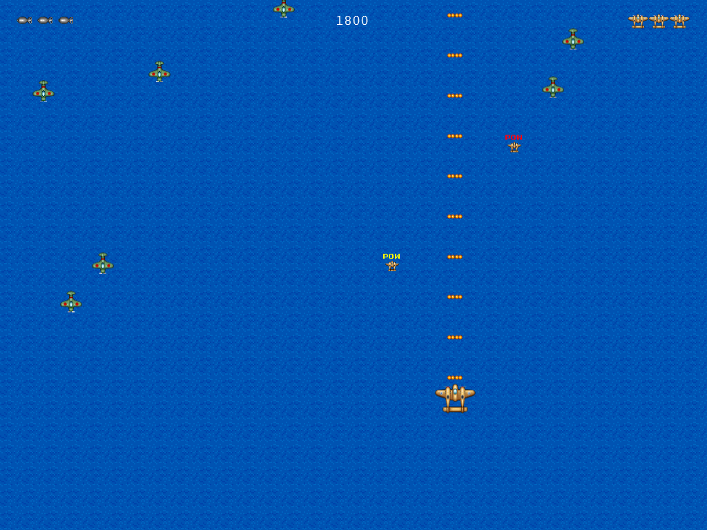
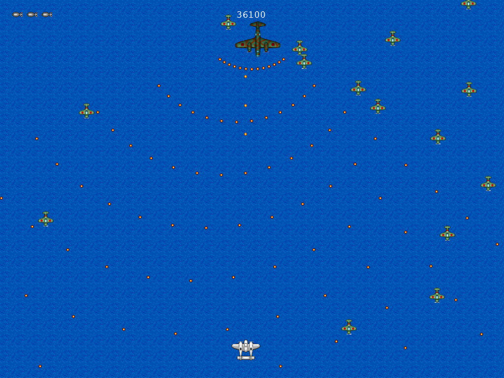
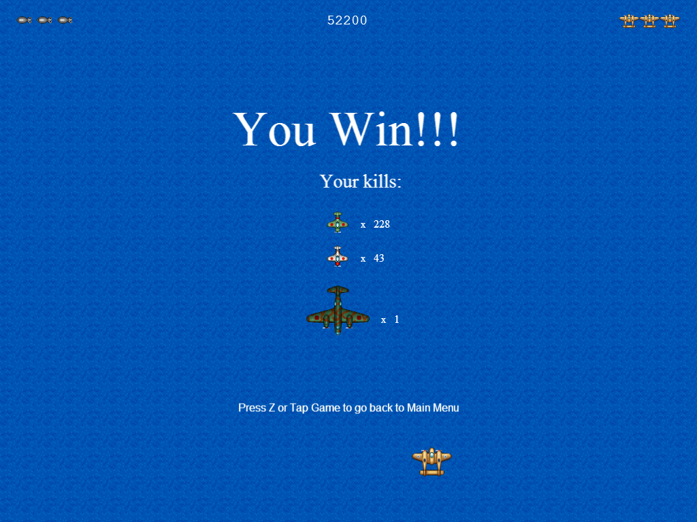
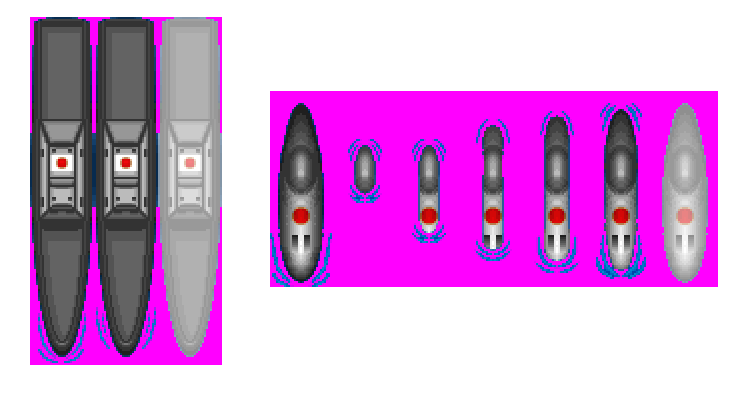

# Evening: What Next?

Congratulations! You've just created and deployed your first HTML5 game!

Your journey is far from over, though, and in this chapter we'll go through your next steps.

## Challenges {#challenges}

A common problem with coding workshops is that some participants _think_ they have already grasped the concepts well when in reality they just knew how to correctly copy-paste the code examples. Prove that you're not one of those people by taking on the following challenges:

* **Add bombs to the game**

    

    Players start with 3 bombs, the current count represented by icons on the top left corner of the scene. Pressing X or tapping one of these icons will trigger the bomb, continuously destroying all enemy bullets and dealing a small amount of damage for a few seconds. This is usually done the moment before an enemy bullet collides with the player.

    

    *Hint:* Use the `bomb.png` as the icon and `bomb-blast.png` as the effect that will cover the whole screen colliding with all enemies.

* **Use the second power-up**

    There's an additional power-up image in the `assets` folder. Use it to give the player a speed boost or a different weapon. For example, here we made the red power-up give a concentrated shot which can be more effective in the boss battle:

    

* **Create a difficulty progression**
    
    Apart from the boss fight at 20000 points, the difficulty stays the same for most of the game session. Add some flags and additional checking to make the game slightly more difficult as the game progresses. For example:

| Score             | Enemy Spawn Rate | Shooter Spawn Rate |           Boss |
| -----------------:| ----------------:| ------------------:| --------------:|
|      **0 - 2000** |             1.0s |                n/a |            n/a |
|   **2000 - 5000** |             0.8s |               3.0s |            n/a |
|  **5000 - 10000** |             0.6s |               2.5s |            n/a |
| **10000 - 17500** |             0.5s |               2.0s |            n/a |
| **17500 - 25000** |             0.3s |               1.5s |            n/a |
|       **> 25000** |             0.6s |      stop spawning | spawn the boss |

* **Add new patterns and phases to the boss fight**

    The patterns can be movement patterns (not just bouncing left and right) and shooting patterns.

    

* **Display the breakdown of kills at the end of the game**

    

* **Add new enemies: the destroyer and the sub**

    

    There are two unused enemy sprite sheets: one for a destroyer and one for a submarine. Being sea units, they will have to behave a bit differently from their flying counterparts, namely, they are below all other flying sprites, and they can't overlap with each other.

* **Refactor parts of the code.**

    There are still places where the code is duplicated 3 or more times. Turn them into functions to reduce the code size.

    You can also try converting some of the game objects into JS objects. The _Tank_ example in [_Phaser Examples_](http://phaser.io/examples) is way to implement this.

* **Convert time-related events to use Phaser's time classes**

    Many of the time-related code in our game only uses the current time as reference. This results in incorrect behavior in certain situations (e.g. pausing the game).

    Replace those code with the appropriate [Time](https://phaser.io/docs/2.3.0/Phaser.Time.html) and [Timer](https://phaser.io/docs/2.3.0/Phaser.Timer.html) functions. See the _Time_ section of [_Phaser Examples_](http://phaser.io/examples) for ideas on how to do this.

## What we didn't cover

We've skipped a lot of Phaser topics. Here are some topics you might want to look into after this workshop:

* Other _Phaser_ settings (e.g. auto-scale, pause on lose focus)
* Background music
* Mobile support (e.g. additional features, packaging to app stores)
* P2 physics
* Performance tuning and Debugging
* Persisting data
* Interacting with libraries and APIs

Many of these are covered by the official documentation and by some of [the tutorials on this list](http://www.lessmilk.com/phaser-tutorial/). For the rest, feel free to ask about them at the [official Phaser forum](http://www.html5gamedevs.com/forum/14-phaser/).

We also did not cover how to prepare assets for your game. There are lists of free resources out there like this [wiki page](http://freegamedev.net/wiki/Art_asset_resources) (which also lists where we got our sounds, [OpenGameArt.org](http://opengameart.org/)). You can also Google for assets, but you have to check their licenses and see if you can use them in your games.

Processing assets is also something that is out of the scope of this tutorial. For example, our art assets came from [SpriteLib](http://www.widgetworx.com/spritelib/) but they had to be converted into sprite sheets that are compatible with _Phaser_ (e.g. convert blue to transparent, add damage effect to enemy, etc.), and the volume of our sound assets had to be tweaked a bit.

For image editing, you can look for [Paint.NET](http://www.getpaint.net/) and [Gimp](http://www.gimp.org/) tutorials. For sound editing, you check out [Audacity](http://audacity.sourceforge.net/) tutorials.
