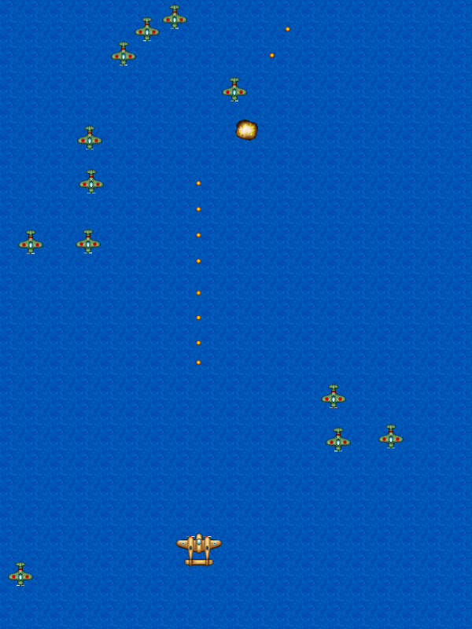

# Intermission: Refactoring

Before we proceed with the rest of the lessons, let's [_refactor_](http://en.wikipedia.org/wiki/Code_refactoring) the code to make it easier for us to change and maintain the code later. This should not change the behavior of the game, so this is just an intermission rather than a full afternoon chapter.

## Refactoring Functions

First on our list of things to refactor are our `create()` and `update()` functions. They're getting bigger and they will be worse as we proceed with the workshop. We'll refactor them by [splitting these large functions into smaller functions](http://refactoring.com/catalog/extractMethod.html).

A> ### Function Order
A>
A> There's no generally accepted standard for ordering functions within classes. Modern editors and IDEs have features (e.g. quick search, code folding) that allow devs to order functions any way they like.
A> 
A> For our program, our standard will be to group functions according to their usage. This will reduce the amount of scrolling needed when editing multiple functions.
A> 
A> Here is the general outline of our `game.js` after our refactoring:
A> 
A> * Phaser game loop functions
A> * Functions called by `create()`
A> * Functions called by `update()` 

### Refactoring create

Let's start by extracting functions out of `create()`. Replace the contents of the function with:

{linenos=on,starting-line-number=15,lang="js"}
~~~~~~~~
  create: function () {
{leanpub-start-insert}
    this.setupBackground();
    this.setupPlayer();
    this.setupEnemies();
    this.setupBullets();
    this.setupExplosions();
    this.setupText();
{leanpub-end-insert}

    this.cursors = this.input.keyboard.createCursorKeys();
  },
~~~~~~~~

Then insert the following after `render()`:

{linenos=on,starting-line-number=79,lang="js"}
~~~~~~~~
  //
  // create()- related functions
  //
  setupBackground: function () {
    this.sea = this.add.tileSprite(0, 0, 800, 600, 'sea');
    this.sea.autoScroll(0, 12);
  },

  setupPlayer: function () {
    this.player = this.add.sprite(400, 550, 'player');
    this.player.anchor.setTo(0.5, 0.5);
    this.player.animations.add('fly', [ 0, 1, 2 ], 20, true);
    this.player.play('fly');
    this.physics.enable(this.player, Phaser.Physics.ARCADE);
    this.player.speed = 300;
    this.player.body.collideWorldBounds = true;
    // 20 x 20 pixel hitbox, centered a little bit higher than the center
    this.player.body.setSize(20, 20, 0, -5);
  },

  setupEnemies: function () {
    this.enemyPool = this.add.group();
    this.enemyPool.enableBody = true;
    this.enemyPool.physicsBodyType = Phaser.Physics.ARCADE;
    this.enemyPool.createMultiple(50, 'greenEnemy');
    this.enemyPool.setAll('anchor.x', 0.5);
    this.enemyPool.setAll('anchor.y', 0.5);
    this.enemyPool.setAll('outOfBoundsKill', true);
    this.enemyPool.setAll('checkWorldBounds', true);

    // Set the animation for each sprite
    this.enemyPool.forEach(function (enemy) {
      enemy.animations.add('fly', [ 0, 1, 2 ], 20, true);
    });

    this.nextEnemyAt = 0;
    this.enemyDelay = 1000;
  },

  setupBullets: function () {
    // Add an empty sprite group into our game
    this.bulletPool = this.add.group();

    // Enable physics to the whole sprite group
    this.bulletPool.enableBody = true;
    this.bulletPool.physicsBodyType = Phaser.Physics.ARCADE;

    // Add 100 'bullet' sprites in the group.
    // By default this uses the first frame of the sprite sheet and
    //   sets the initial state as non-existing (i.e. killed/dead)
    this.bulletPool.createMultiple(100, 'bullet');

    // Sets anchors of all sprites
    this.bulletPool.setAll('anchor.x', 0.5);
    this.bulletPool.setAll('anchor.y', 0.5);

    // Automatically kill the bullet sprites when they go out of bounds
    this.bulletPool.setAll('outOfBoundsKill', true);
    this.bulletPool.setAll('checkWorldBounds', true);

    this.nextShotAt = 0;
    this.shotDelay = 100;
  },

  setupExplosions: function () {
    this.explosionPool = this.add.group();
    this.explosionPool.enableBody = true;
    this.explosionPool.physicsBodyType = Phaser.Physics.ARCADE;
    this.explosionPool.createMultiple(100, 'explosion');
    this.explosionPool.setAll('anchor.x', 0.5);
    this.explosionPool.setAll('anchor.y', 0.5);
    this.explosionPool.forEach(function (explosion) {
      explosion.animations.add('boom');
    });
  },

  setupText: function () {
    this.instructions = this.add.text( 400, 500, 
      'Use Arrow Keys to Move, Press Z to Fire\n' + 
      'Tapping/clicking does both', 
      { font: '20px monospace', fill: '#fff', align: 'center' }
    );
    this.instructions.anchor.setTo(0.5, 0.5);
    this.instExpire = this.time.now + 10000;
  },
~~~~~~~~

We also added a call to [`this.sea.autoScroll()`](http://docs.phaser.io/Phaser.TileSprite.html#autoScroll) so that we can remove the `this.sea.tilePosition.y += 0.2` from the `update()` later.

### Refactoring update

Now replace the contents of `update()` with the following:

{linenos=on,starting-line-number=26,lang="js"}
~~~~~~~~
  update: function () {
{leanpub-start-insert}
    this.checkCollisions();
    this.spawnEnemies();
    this.processPlayerInput();
    this.processDelayedEffects();
{leanpub-end-insert}
  },
~~~~~~~~

Insert the new functions after the `create()` functions:

{linenos=on,starting-line-number=122,lang="js"}
~~~~~~~~
  //
  // update()- related functions
  //
  checkCollisions: function () {
    this.physics.arcade.overlap(
      this.bulletPool, this.enemyPool, this.enemyHit, null, this
    );

    this.physics.arcade.overlap(
      this.player, this.enemyPool, this.playerHit, null, this
    );
  },

  spawnEnemies: function () {
    if (this.nextEnemyAt < this.time.now && this.enemyPool.countDead() > 0) {
      this.nextEnemyAt = this.time.now + this.enemyDelay;
      var enemy = this.enemyPool.getFirstExists(false);
      // spawn at a random location top of the screen
      enemy.reset(this.rnd.integerInRange(20, 780), 0);
      // also randomize the speed
      enemy.body.velocity.y = this.rnd.integerInRange(30, 60);
      enemy.play('fly');
    }
  },

  processPlayerInput: function () {
    this.player.body.velocity.x = 0;
    this.player.body.velocity.y = 0;

    if (this.cursors.left.isDown) {
      this.player.body.velocity.x = -this.player.speed;
    } else if (this.cursors.right.isDown) {
      this.player.body.velocity.x = this.player.speed;
    }

    if (this.cursors.up.isDown) {
      this.player.body.velocity.y = -this.player.speed;
    } else if (this.cursors.down.isDown) {
      this.player.body.velocity.y = this.player.speed;
    }

    if (this.input.activePointer.isDown &&
        this.physics.arcade.distanceToPointer(this.player) > 15) {
      this.physics.arcade.moveToPointer(this.player, this.player.speed);
    }

    if (this.input.keyboard.isDown(Phaser.Keyboard.Z) ||
        this.input.activePointer.isDown) {
      this.fire();
    }
  },

  processDelayedEffects: function () {
    if (this.instructions.exists && this.time.now > this.instExpire) {
      this.instructions.destroy();
    }
  },
~~~~~~~~

## Reducing Hard-coded Values

Apart from long functions, our game also has many hard-coded values and this may affect code readability and maintenance later. 

Eliminating all hard-coded values would be overkill especially for a tutorial like this, so our goal here would be show the ways how we could reduce them.

### Using Relative Values

A good portion of the hard-coded values are x-y coordinates. Replacing them with values relative to `game.width` and `game.height` will allow us to change the size of the game later with minimal impact to the code.

Let's start with the background tile sprite:

{linenos=off,lang="js"}
~~~~~~~~
  setupBackground: function () {
{leanpub-start-delete}
    this.sea = this.add.tileSprite(0, 0, 800, 600, 'sea');
{leanpub-end-delete}
{leanpub-start-insert}
    this.sea = this.add.tileSprite(0, 0, this.game.width, this.game.height, 'sea');
{leanpub-end-insert}
    this.sea.autoScroll(0, 12);
  },
~~~~~~~~

Then we change the player starting location to the bottom middle of the screen:

{linenos=off,lang="js"}
~~~~~~~~
  setupPlayer: function () {
{leanpub-start-delete}
    this.player = this.add.sprite(400, 550, 'player');
{leanpub-end-delete}
{leanpub-start-insert}
    this.player = this.add.sprite(this.game.width / 2, this.game.height - 50, 'player');
{leanpub-end-insert}
    this.player.anchor.setTo(0.5, 0.5);
~~~~~~~~

Also the instruction text:

{linenos=off,lang="js"}
~~~~~~~~
  setupText: function () {
{leanpub-start-delete}
    this.instructions = this.add.text( 400, 500, 
{leanpub-end-delete}
{leanpub-start-insert}
    this.instructions = this.add.text(
      this.game.width / 2, 
      this.game.height - 100, 
{leanpub-end-insert}
      'Use Arrow Keys to Move, Press Z to Fire\n' + 
~~~~~~~~

And finally the spawn location for the enemies:

{linenos=off,lang="js"}
~~~~~~~~
  spawnEnemies: function () {
    if (this.nextEnemyAt < this.time.now && this.enemyPool.countDead() > 0) {
      this.nextEnemyAt = this.time.now + this.enemyDelay;
      var enemy = this.enemyPool.getFirstExists(false);
      // spawn at a random location top of the screen
{leanpub-start-delete}
      enemy.reset(this.rnd.integerInRange(20, 780), 0);
{leanpub-end-delete}
{leanpub-start-insert}
      enemy.reset(this.rnd.integerInRange(20, this.game.width - 20), 0);
{leanpub-end-insert}
      // also randomize the speed
      enemy.body.velocity.y = this.rnd.integerInRange(30, 60);
~~~~~~~~

One advantage of using relative values is that we can change the dimensions of the game without having to change any of the code. For example, here's the game with the height and width flipped at `app.js`:

### Using Constants

We can also replace many hard-coded values with constants. If you open `boot.js`, you'll see that all of the constants that we need for this workshop are already defined under the `BasicGame` object. All we need to do is to replace the existing code with their respective constants:

{linenos=off,lang="js"}
~~~~~~~~
  setupBackground: function () {
    this.sea = this.add.tileSprite(0, 0, this.game.width, this.game.height, 'sea');
{leanpub-start-delete}
    this.sea.autoScroll(0, 12);
{leanpub-end-delete}
{leanpub-start-insert}
    this.sea.autoScroll(0, BasicGame.SEA_SCROLL_SPEED);
{leanpub-end-insert}
  },
~~~~~~~~

{linenos=off,lang="js"}
~~~~~~~~
  setupPlayer: function () {
...
    this.physics.enable(this.player, Phaser.Physics.ARCADE);
{leanpub-start-delete}
    this.player.speed = 300;
{leanpub-end-delete}
{leanpub-start-insert}
    this.player.speed = BasicGame.PLAYER_SPEED;
{leanpub-end-insert}
    this.player.body.collideWorldBounds = true;
~~~~~~~~

{linenos=off,lang="js"}
~~~~~~~~
  setupEnemies: function () {
...
    this.nextEnemyAt = 0;
{leanpub-start-delete}
    this.enemyDelay = 1000;
{leanpub-end-delete}
{leanpub-start-insert}
    this.enemyDelay = BasicGame.SPAWN_ENEMY_DELAY;
{leanpub-end-insert}
  },
~~~~~~~~

{linenos=off,lang="js"}
~~~~~~~~
  setupBullets: function () {
...
    this.nextShotAt = 0;
{leanpub-start-delete}
    this.shotDelay = 100;
{leanpub-end-delete}
{leanpub-start-insert}
    this.shotDelay = BasicGame.SHOT_DELAY;
{leanpub-end-insert}
  },
~~~~~~~~

{linenos=off,lang="js"}
~~~~~~~~
  setupText: function () {
...
    this.instructions.anchor.setTo(0.5, 0.5);
{leanpub-start-delete}
    this.instExpire = this.time.now + 10000;
{leanpub-end-delete}
{leanpub-start-insert}
    this.instExpire = this.time.now + BasicGame.INSTRUCTION_EXPIRE;
{leanpub-end-insert}
  },
~~~~~~~~

{linenos=off,lang="js"}
~~~~~~~~
  spawnEnemies: function () {
    if (this.nextEnemyAt < this.time.now && this.enemyPool.countDead() > 0) {
...
      // also randomize the speed
{leanpub-start-delete}
      enemy.body.velocity.y = this.rnd.integerInRange(30, 60);
{leanpub-end-delete}
{leanpub-start-insert}
      enemy.body.velocity.y = this.rnd.integerInRange(
        BasicGame.ENEMY_MIN_Y_VELOCITY, BasicGame.ENEMY_MAX_Y_VELOCITY
      );
{leanpub-end-insert}
      enemy.play('fly');
    }
  },
~~~~~~~~

{linenos=off,lang="js"}
~~~~~~~~
  fire: function () {
...
{leanpub-start-delete}
    bullet.body.velocity.y = -500;
{leanpub-end-delete}
{leanpub-start-insert}
    bullet.body.velocity.y = -BasicGame.BULLET_VELOCITY;
{leanpub-end-insert}
  },
~~~~~~~~
