# Afternoon 1: Sprites, the Game Loop, and Basic Physics

In this first part, we'll go over how to draw and move objects on our game.

## Sprite Basics

### Draw Bullet Sprite 

Let's start with something basic -- drawing an object on the game stage. The most basic object in _Phaser_ is the [_Sprite_](http://docs.phaser.io/Phaser.Sprite.html). So for our first piece of code, let's load then draw a bullet sprite on our game by making the following modifications to `game.js`. (All of the code examples in this tutorial refer to `game.js` unless otherwise noted.)

{linenos=off,lang="js"}
~~~~~~~~
  preload: function () {
    this.load.image('sea', 'assets/sea.png');
{leanpub-start-insert}
    this.load.image('bullet', 'assets/bullet.png');
{leanpub-end-insert}
  },

  create: function () {

    this.sea = this.add.tileSprite(0, 0, 800, 600, 'sea');

{leanpub-start-insert}
    this.bullet = this.add.sprite(400, 300, 'bullet');
{leanpub-end-insert}

  }
~~~~~~~~

We called the following functions:

* [`load.image()`](http://docs.phaser.io/Phaser.Loader.html#image) - loads an image (e.g. `assets/bullet.png`) and assigns it a name (e.g. `bullet`) which we use later.
* [`add.sprite()`](http://docs.phaser.io/Phaser.GameObjectFactory.html#sprite) - accepts the x-y coordinates of our sprite and the name of the sprite which we assigned in the `load.image()` function.

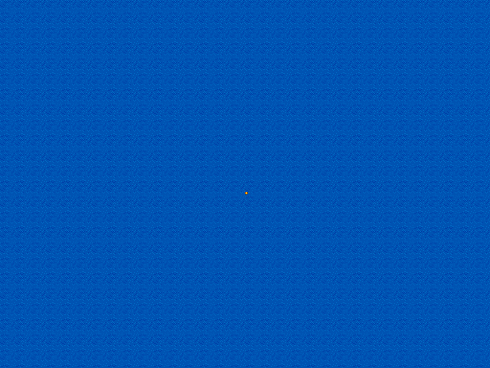

### Screen Coordinates vs Cartesian Coordinates

At around middle school, children learn about the Cartesian coordinate system where points, defined by an ordered pair `(x, y)`, can be plotted on a plane. The center is `(0, 0)`, x-values increase as you go right, while y-values increase as you go up.

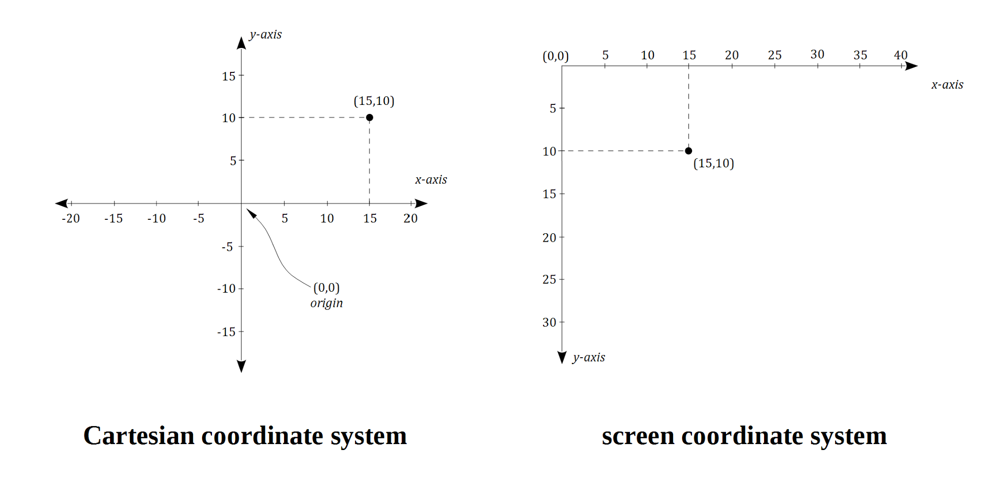

However, computer displays do not use Cartesian coordinates _as is_ but instead use a variation: instead of being at the center, `(0, 0)` represents the point at the top-left, and instead of decreasing, y-values increase as you go down. This picture illustrates the screen coordinate system in our game at the moment:

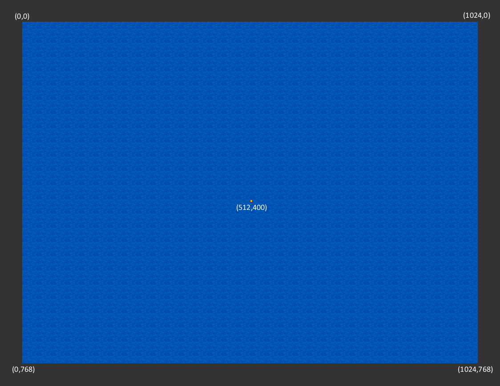

W> ## A note about the _Phaser Examples_
W>
W> The biggest difference between the [_Phaser Examples_](http://examples.phaser.io/) and our game template is that the former uses global variables while we're adding [States](http://docs.phaser.io/Phaser.State.html) which encapsulate the logic of our game. This means that you can't copy the code from those examples directly. For example, _01 - load an image_ uses the following syntax:
W> 
W> {linenos=off,lang="js"}
W> ~~~~~~~~
W>   game.add.sprite(0, 0, 'einstein');
W> ~~~~~~~~
W> 
W> We don't have a `game` global variable within the scope in our `BasicGame.Game` state object. Instead, we have a `this.game` property so translating the code above into our template would be:
W> 
W> {linenos=off,lang="js"}
W> ~~~~~~~~
W>   this.game.add.sprite(0, 0, 'einstein');
W> ~~~~~~~~
W> 
W> Adding `this.game` over and over in your code might make you wish for a global variable. Fortunately, _Phaser_ also adds the other game properties into the state. You can see a list of this in the [original game template](https://github.com/photonstorm/phaser/blob/master/resources/Project%20Templates/Basic/Game.js):
W> 
W> {linenos=off,lang="js"}
W> ~~~~~~~~
W> BasicGame.Game = function (game) {
W> 
W>   // When a State is added to Phaser it automatically has the following 
W>   //  properties set on it, even if they already exist:
W> 
W>   this.game;      // a reference to the currently running game
W>   this.add;       // used to add sprites, text, groups, etc
W>   this.camera;    // a reference to the game camera
W>   this.cache;     // the game cache
W>   this.input;     // the global input manager (you can access this.input.keyboard, 
W>                   //   this.input.mouse, as well from it)
W>   this.load;      // for preloading assets
W>   this.math;      // lots of useful common math operations
W>   this.sound;     // the sound manager - add a sound, play one, set-up markers, etc
W>   this.stage;     // the game stage
W>   this.time;      // the clock
W>   this.tweens;    //  the tween manager
W>   this.state;     // the state manager
W>   this.world;     // the game world
W>   this.particles; // the particle manager
W>   this.physics;   // the physics manager
W>   this.rnd;       // the repeatable random number generator
W> 
W>   // You can use any of these from any function within this State.
W>   // But do consider them as being 'reserved words', i.e. don't create a property
W>   // for your own game called "world" or you'll over-write the world reference.
W> 
W> };
W> ~~~~~~~~
W> 
W> In other words, you only need to use `this.add` in place of `this.game.add`:
W> 
W> {linenos=off,lang="js"}
W> ~~~~~~~~
W>   this.add.sprite(0, 0, 'einstein');
W> ~~~~~~~~
W>
W> Which is exactly what we used for adding a sprite above.

### Draw Enemy Animation

Let's then proceed with something more complicated, an animated sprite.

We first load a sprite sheet, an image containing multiple frames, in the pre-loading function.

{linenos=off,lang="js"}
~~~~~~~~
  preload: function () {
    this.load.image('sea', 'assets/sea.png');
    this.load.image('bullet', 'assets/bullet.png');
{leanpub-start-insert}
    this.load.spritesheet('greenEnemy', 'assets/enemy.png', 32, 32);
{leanpub-end-insert}
  },
~~~~~~~~

Instead of `load.image()`, we used [`load.spritesheet()`](http://docs.phaser.io/Phaser.Loader.html#spritesheet) to load our sprite sheet. The two additional arguments are the width and height of the individual frames. Since we defined `32` for both width and height, _Phaser_ will load the sprite sheet and divide it into individual frames like so:

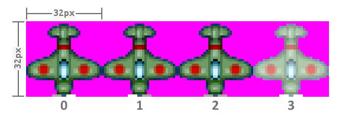

Now that the sprite sheet is loaded, we can now add it into our game:

{linenos=off,lang="js"}
~~~~~~~~
  create: function() {

    this.sea = this.add.tileSprite(0, 0, 800, 600, 'sea');

{leanpub-start-insert}
    this.enemy = this.add.sprite(400, 200, 'greenEnemy');
    this.enemy.animations.add('fly', [ 0, 1, 2 ], 20, true);
    this.enemy.play('fly');
{leanpub-end-insert}

    this.bullet = this.add.sprite(400, 300, 'bullet');
  }
~~~~~~~~

The [`animations.add()`](http://docs.phaser.io/Phaser.AnimationManager.html#add) function specified the animation: its name, followed by the sequence of frames in an array, followed by the speed of the animation (in frames per second), and a flag telling whether the animation loops or not. So in this piece of code, we defined the `fly` animation that loops the first 3 frames of the green enemy sprite sheet, an animation of the propeller spinning:

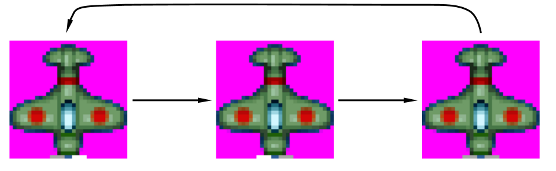

I> ### Ordering
I> 
I> Note how we added the bullet sprite after the enemy sprite. As we shall see later, this declaration will put the bullet sprite above the enemy sprite.
I>
I> There are ways to rearrange the order of the sprites (e.g. top to bottom) but the simplest way is to create them already in a bottom-to-top order.

### Set Object Anchor

The sprites share the same x-coordinate, so by default they are left-aligned.

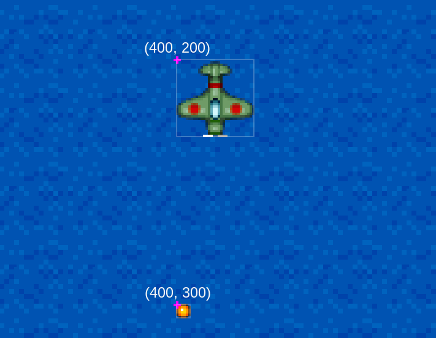

For games, however, most of the time we want the x-y coordinates to be the center of the sprite. We can do that in _Phaser_ by modifying the anchor settings:

{linenos=off,lang="js"}
~~~~~~~~
    this.enemy = this.add.sprite(400, 300, 'greenEnemy');
    this.enemy.animations.add('fly', [ 0, 1, 2 ], 20, true);
    this.enemy.play('fly');
{leanpub-start-insert}
    this.enemy.anchor.setTo(0.5, 0.5);
{leanpub-end-insert}

    this.bullet = this.add.sprite(400, 400, 'bullet');
{leanpub-start-insert}
    this.bullet.anchor.setTo(0.5, 0.5);
{leanpub-end-insert}
~~~~~~~~

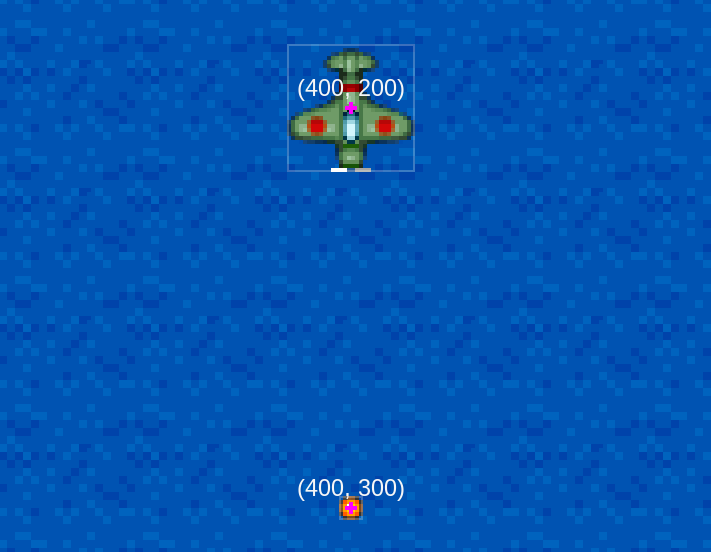

The `(0.5, 0.5)` centers the sprite. On the other hand, `(0, 0)` will mean that the x-y coordinate defines the top-left of the sprite. Similarly, `(1, 1)` put the x-y at the bottom right of the sprite.

## The Game Loop

The following is an oversimplified diagram on what happens when _Phaser_ games run:

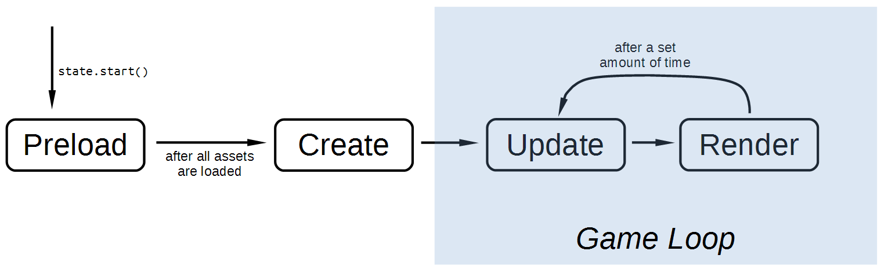

* **Preload** - The game starts with a pre-load section where all assets are pre-loaded. Without pre-loading, the game will stutter or hang in the middle of gameplay because it has to load assets.
* **Create** - After pre-loading all assets, we can now setup the initial state of the game.
* **Update** - At a set interval (usually 60 times per second), this function is called to update the game state. All updates to the game are done here. For example, checking if the character has collided with the enemy, spawning an enemy at a random location, moving a character to the left because the player pressed the left arrow key, etc.
* **Render** - coming after Update, here is where the latest state of the game is drawn (rendered) to the screen.

The update-render loop is what's called the ***Game Loop***, and is the heart of almost every computer game. You can read more about the Game Loop [at the Game Programming Patterns site](http://gameprogrammingpatterns.com/game-loop.html).

### Move Bullet via update()

Now that we know how the game loop is implemented in _Phaser_, let's move our bullet sprite vertically by reducing its y-coordinate in the `update()` function: 

{linenos=off,lang="js"}
~~~~~~~~
  update: function () {
    this.sea.tilePosition.y += 0.2;
{leanpub-start-insert}
    this.bullet.y -= 1;
{leanpub-end-insert}
  },
~~~~~~~~

As mentioned above, _Phaser_ will call the `update()` function at a regular interval, effectively moving the bullet upwards at a rate of around 60 pixels per second.

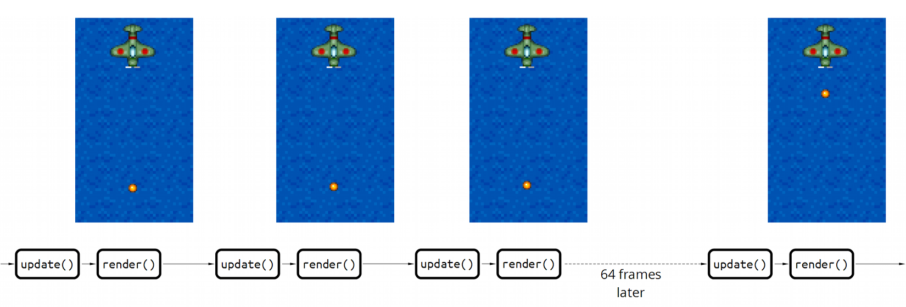

This is how you move sprites in most basic game libraries/frameworks. In _Phaser_, though, we can let the physics engine do almost all of the dirty work for us.

A> ### Missing render()?
A>
A> Before we discuss how to use _Phaser_'s physics engines, let's explain why we still don't have a `render()` function and yet the game renders the game state on its own.
A> 
A> First off, as some might have noticed from the `app.js`, we're only coding a portion of the game called the `state` which, as the name implies, is a state of the game.
A> 
A> {linenos=off,lang="js"}
A> ~~~~~~~~
A>   game.state.add('Boot', BasicGame.Boot);
A>   game.state.add('Preloader', BasicGame.Preloader);
A>   game.state.add('MainMenu', BasicGame.MainMenu);
A> {leanpub-start-insert}
A>   game.state.add('Game', BasicGame.Game);
A> {leanpub-end-insert}
A> ~~~~~~~~
A> 
A> The state is just one of the many things updated and rendered in _Phaser_'s game loop. For instance, here's what the `Game` object calls on update (pre- and post-update hooks removed):
A> 
A> {linenos=off,lang="js"}
A> ~~~~~~~~
A> {leanpub-start-insert}
A>   this.state.update();
A> {leanpub-end-insert}
A>   this.stage.update();
A>   this.tweens.update();
A>   this.sound.update();
A>   this.input.update();
A>   this.physics.update();
A>   this.particles.update();
A>   this.plugins.update();
A> ~~~~~~~~
A> 
A> And here's the render section:
A> 
A> {linenos=off,lang="js"}
A> ~~~~~~~~
A>   this.renderer.render(this.stage);
A>   this.plugins.render();
A> {leanpub-start-insert}
A>   this.state.render();
A> {leanpub-end-insert}
A>   this.plugins.postRender();
A> ~~~~~~~~
A> 
A> We don't need to write code to render our sprites because that is already covered by the first line, `this.renderer.render(this.stage);`, with `this.stage` containing all of the sprites currently in the game.
A> 
A> We'll write some render code later for debugging purposes.

## Apply Physics

_Phaser_ comes with 2 physics systems, _Arcade_ and _P2_. Arcade is the default and the simplest, and so we'll use that.

(And besides, the version of _Phaser_ bundled with the basic template, `phaser-arcarde-physics.min.js`, contains _only_ Arcade physics to reduce download file size.)

### Velocity

Once we put our bullet into the Arcade physics system, we can now set its velocity and let the system handle all the other calculations (e.g. future position).

{linenos=off,lang="js"}
~~~~~~~~
    this.bullet = this.add.sprite(400, 400, 'bullet');
    this.bullet.anchor.setTo(0.5, 0.5);
{leanpub-start-insert}
    this.physics.enable(this.bullet, Phaser.Physics.ARCADE);
    this.bullet.body.velocity.y = -500;
{leanpub-end-insert}

  },

  update: function () {
    this.sea.tilePosition.y += 0.2;
{leanpub-start-delete}
    this.bullet.y -= 1;
{leanpub-end-delete}
  },
~~~~~~~~

With the physics enabled and velocity set, our sprite's coordinates will now be updated by the `this.physics.update();` call rather than our `update` code. In this case, "`velocity.y = -500`" is 500 pixels per second upward; at 60 frames per second, each `update` call will move the bullet up 8-9 pixels.

### Show Body Debug

Arcade physics is limited to _axis-aligned bounding box_ (AABB) collision checking only. In simpler terms, all objects under Arcade are rectangles.

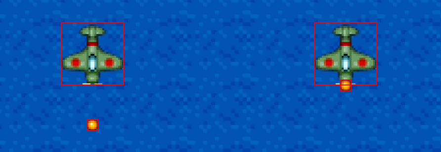

We can view these rectangles by rendering these areas with the debugger. First we add the enemy sprite to the physics system:

{linenos=off,lang="js"}
~~~~~~~~
    this.enemy.play('fly');
    this.enemy.anchor.setTo(0.5, 0.5);
{leanpub-start-insert}
    this.physics.enable(this.enemy, Phaser.Physics.ARCADE);
{leanpub-end-insert}

    this.bullet = this.add.sprite(400, 300, 'bullet');
~~~~~~~~

Then we add the debugging code under our currently nonexistent `render()` function:

{linenos=on,starting-line-number=30,lang="js"}
~~~~~~~~
  update: function () {
    this.sea.tilePosition.y += 0.2;
  },

{leanpub-start-insert}
  render: function() {
    this.game.debug.body(this.bullet);
    this.game.debug.body(this.enemy);
  },
{leanpub-end-insert}
~~~~~~~~

### Collision

Once added to the physics system, checking collision and overlapping is only a matter of calling [the right functions](http://docs.phaser.io/Phaser.Physics.Arcade.html#overlap): 

{linenos=off,lang="js"}
~~~~~~~~
  update: function () {
    this.sea.tilePosition.y += 0.2;
{leanpub-start-insert}
    this.physics.arcade.overlap(
      this.bullet, this.enemy, this.enemyHit, null, this
    );
{leanpub-end-insert}
  },
~~~~~~~~

The `overlap()` function requires a callback which will be called in case the objects overlap. Here's the `enemyHit()` function:

{linenos=on,starting-line-number=42,lang="js"}
~~~~~~~~
{leanpub-start-insert}
  enemyHit: function (bullet, enemy) {
    bullet.kill();
    enemy.kill();
  },
{leanpub-end-insert}
~~~~~~~~

Being common situation in games, _Phaser_ provides us with a [`sprite.kill()`](http://docs.phaser.io/Phaser.Sprite.html#kill) function for "killing" sprites. Calling this function both marks the sprite as dead and invisible, effectively removing the sprite from the game. 

Here's the collision in action:
 
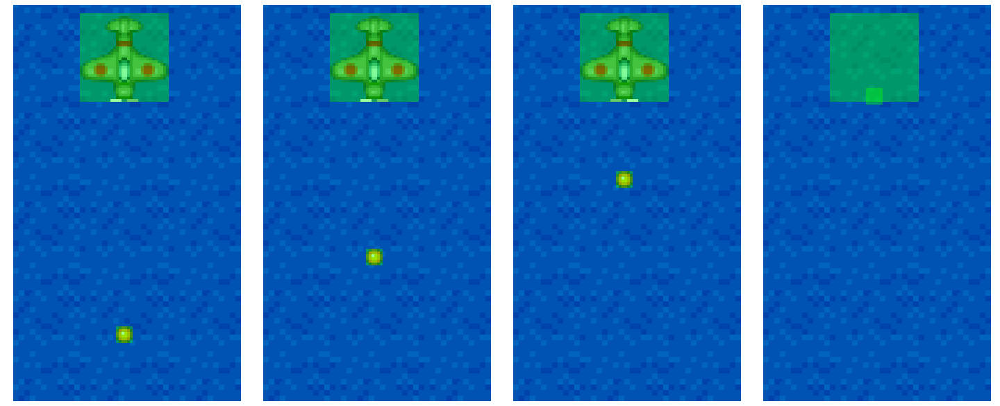

With debug on, we can see that the sprite is still at that location but it's invisible and the physics engine ignores it (i.e. it no longer moves).

{pagebreak}

### Remove Debugging 

Debugging isn't really required in this workshop so you should probably remove or comment out the debugging code when you're done testing.

{linenos=off,lang="js"}
~~~~~~~~
  render: function() {
{leanpub-start-delete}
    this.game.debug.body(this.bullet);
    this.game.debug.body(this.enemy);
{leanpub-end-delete}
  },
~~~~~~~~

### Explosion

Before we proceed to the next lesson, let's improve our collision handling by adding an explosion animation in the place of the enemy. Here's the animation pre-loading:

{linenos=off,lang="js"}
~~~~~~~~
  preload: function () {
    this.load.image('sea', 'assets/sea.png');
    this.load.image('bullet', 'assets/bullet.png');
    this.load.spritesheet('greenEnemy', 'assets/enemy.png', 32, 32);
{leanpub-start-insert}
    this.load.spritesheet('explosion', 'assets/explosion.png', 32, 32);
{leanpub-end-insert}
  },
~~~~~~~~

Then the actual explosion:

{linenos=off,lang="js"}
~~~~~~~~
  enemyHit: function (bullet, enemy) {
    bullet.kill();
    enemy.kill();
{leanpub-start-insert}
    var explosion = this.add.sprite(enemy.x, enemy.y, 'explosion');
    explosion.anchor.setTo(0.5, 0.5);
    explosion.animations.add('boom');
    explosion.play('boom', 15, false, true);
{leanpub-end-insert}
  },
~~~~~~~~

Here we used a different way to setup animations. This time we used `animations.add()` with only the name of the animation. Lacking the other arguments, the `boom` animation uses all frames of the sprite sheet, runs at 60 fps, and doesn't loop.

We want to tweak the settings of this animation, so we add them to the [`explosion.play()`](http://docs.phaser.io/Phaser.Sprite.html#play) call as additional arguments:

* `15` - set the frames per second
* `false` - don't loop the animation
* `true` - kill the sprite at the end of the animation

The last argument the most convenient to us; without it we'll need to register an event handler callback to perform the sprite killing, and event handling is a much later lesson. In the meantime, enjoy your improved "shooting down an enemy" animation:

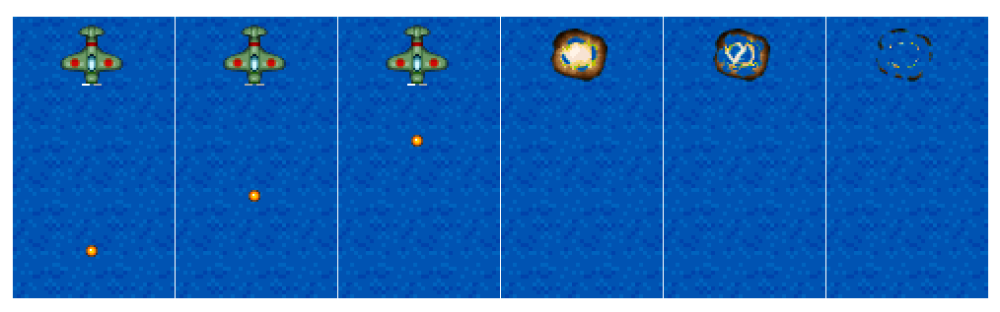
