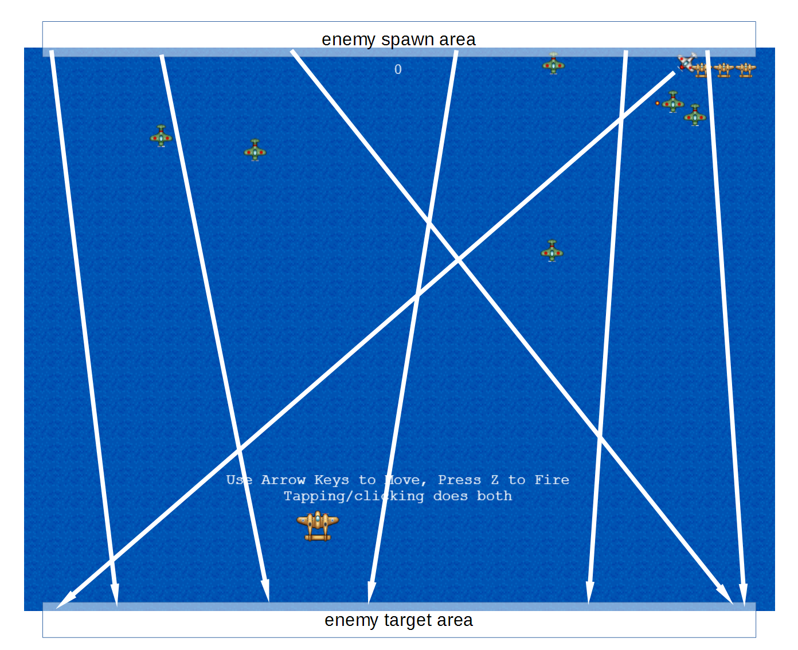
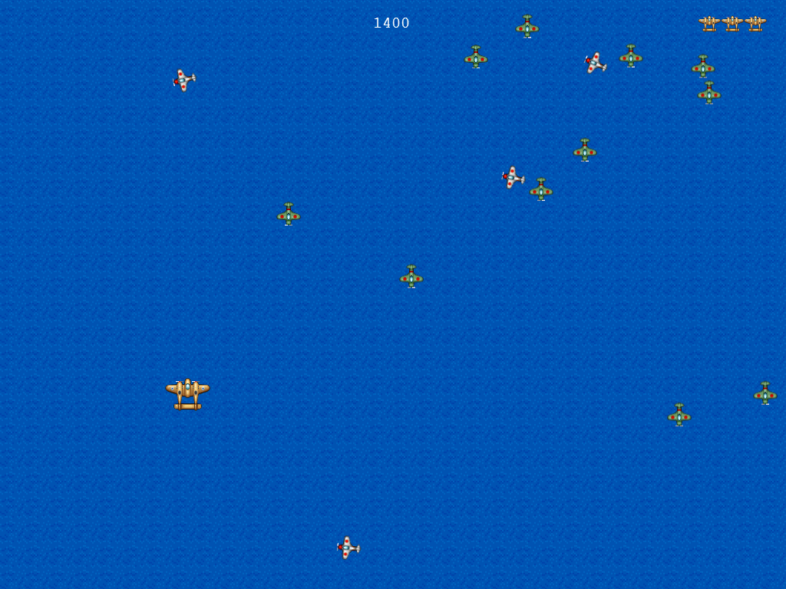
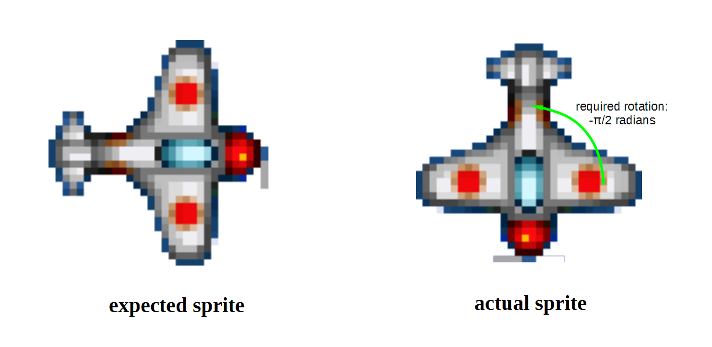
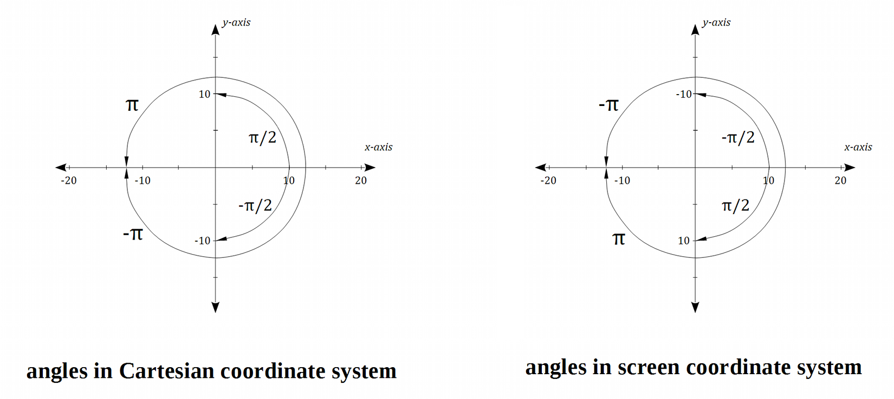
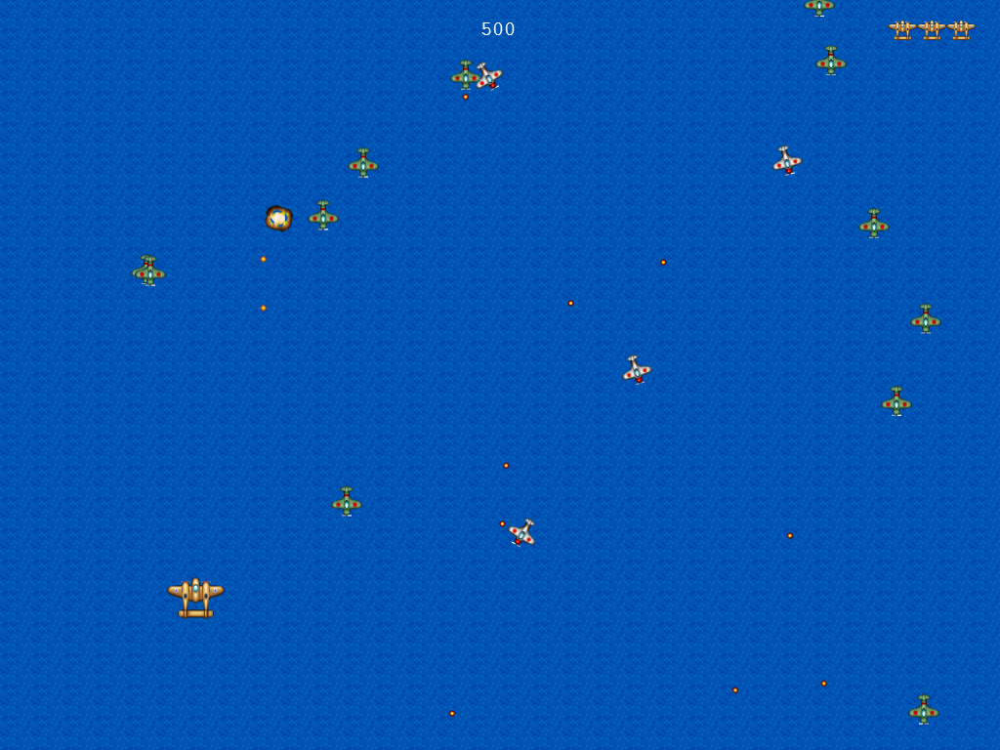
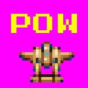
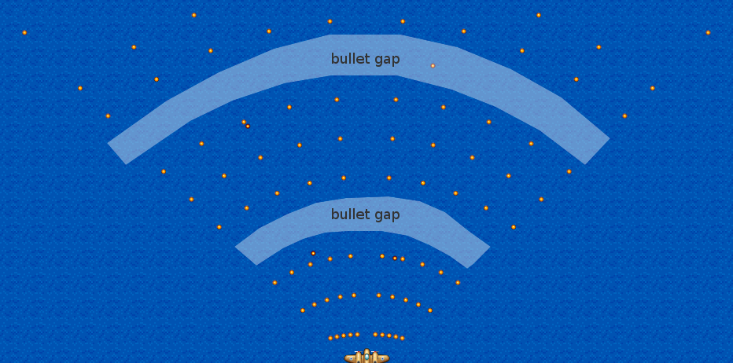
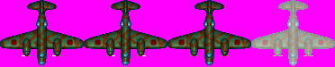
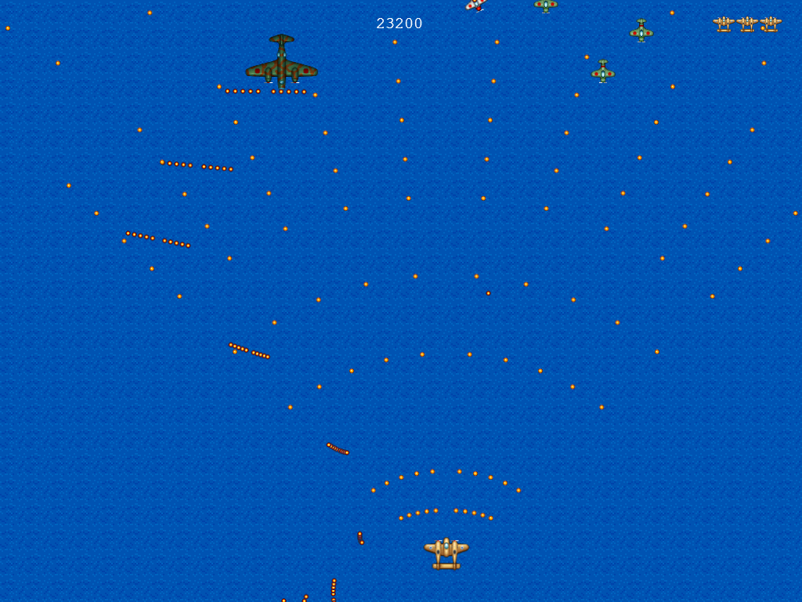
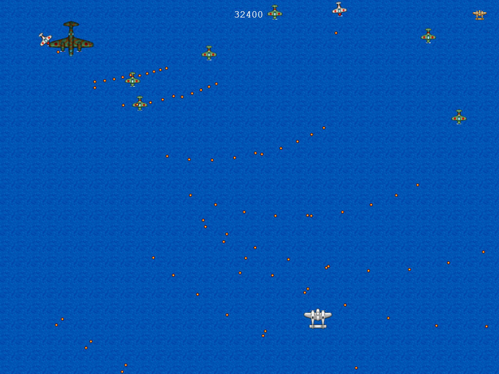

# Afternoon 5: Expanding the Game

Let's flesh out the game by adding an additional enemy, a power-up, a boss battle, and sounds.

## Harder Enemy

The green enemy fighters in our current game pose no real threat to our players. To make our game more difficult, our next enemy type will be able to shoot at our player while also being faster and tougher.

### Enemy Setup

First load the sprite sheet in the pre-loader:

{linenos=off,lang="js"}
~~~~~~~~
  preload: function () {
    this.load.image('sea', 'assets/sea.png');
    this.load.image('bullet', 'assets/bullet.png');
    this.load.spritesheet('greenEnemy', 'assets/enemy.png', 32, 32);
{leanpub-start-insert}
    this.load.spritesheet('whiteEnemy', 'assets/shooting-enemy.png', 32, 32);
{leanpub-end-insert}
    this.load.spritesheet('explosion', 'assets/explosion.png', 32, 32);
    this.load.spritesheet('player', 'assets/player.png', 64, 64);
  },
~~~~~~~~

Then create the group for the sprites (which we will call "shooters" from now on):

{linenos=off,lang="js"}
~~~~~~~~
  setupEnemies: function () {

...
    this.enemyDelay = BasicGame.SPAWN_ENEMY_DELAY;

{leanpub-start-insert}
    this.shooterPool = this.add.group();
    this.shooterPool.enableBody = true;
    this.shooterPool.physicsBodyType = Phaser.Physics.ARCADE;
    this.shooterPool.createMultiple(20, 'whiteEnemy');
    this.shooterPool.setAll('anchor.x', 0.5);
    this.shooterPool.setAll('anchor.y', 0.5);
    this.shooterPool.setAll('outOfBoundsKill', true);
    this.shooterPool.setAll('checkWorldBounds', true);
    this.shooterPool.setAll(
      'reward', BasicGame.SHOOTER_REWARD, false, false, 0, true
    );

    // Set the animation for each sprite
    this.shooterPool.forEach(function (enemy) {
      enemy.animations.add('fly', [ 0, 1, 2 ], 20, true);
      enemy.animations.add('hit', [ 3, 1, 3, 2 ], 20, false);
      enemy.events.onAnimationComplete.add( function (e) {
        e.play('fly');
      }, this);
    });

    // start spawning 5 seconds into the game
    this.nextShooterAt = this.time.now + Phaser.Timer.SECOND * 5;
    this.shooterDelay = BasicGame.SPAWN_SHOOTER_DELAY;
{leanpub-end-insert}
  },
~~~~~~~~

### Diagonal Movement

Instead of moving only downwards like the regular enemy, we'll make the shooters move diagonally across the screen. Add the following code into `spawnEnemies()`:

{linenos=off,lang="js"}
~~~~~~~~
  spawnEnemies: function () {
...
      enemy.play('fly');
    }

{leanpub-start-insert}
    if (this.nextShooterAt < this.time.now && this.shooterPool.countDead() > 0) {
      this.nextShooterAt = this.time.now + this.shooterDelay;
      var shooter = this.shooterPool.getFirstExists(false);

      // spawn at a random location at the top  
      shooter.reset(
        this.rnd.integerInRange(20, this.game.width - 20), 0,
        BasicGame.SHOOTER_HEALTH
      );

      // choose a random target location at the bottom
      var target = this.rnd.integerInRange(20, this.game.width - 20);

      // move to target and rotate the sprite accordingly  
      shooter.rotation = this.physics.arcade.moveToXY(
        shooter, target, this.game.height,
        this.rnd.integerInRange(
          BasicGame.SHOOTER_MIN_VELOCITY, BasicGame.SHOOTER_MAX_VELOCITY
        )
      ) - Math.PI / 2;

      shooter.play('fly');

      // each shooter has their own shot timer 
      shooter.nextShotAt = 0;
    }
{leanpub-end-insert}
  },
~~~~~~~~

The figure above shows the initial spawn and target areas for the shooters; the arrows show possible flight paths. Here we're using [`moveToXY()`](http://docs.phaser.io/Phaser.Physics.Arcade.html#moveToXY), a function similar to `moveToPointer()` which moves the object to a given point in the world.

Both `moveToPointer()` and `moveToXY()` returns the angle towards the target in radians, and we can assign this value to `object.rotation` to rotate our sprite towards the target. But applying the value directly will result in incorrectly oriented shooters:

This is because Phaser assumes that your sprites are oriented to the right. We rotated our sprite counterclockwise `Math.PI / 2` radians (90 degrees) to compensate for the fact that our sprite is oriented downwards.

### Angles/Rotation in Phaser

Angles in Phaser are same as in Trigonometry, though it might look wrong at first glance for those used to Cartesian coordinates rather than screen coordinates.

The rotation seems flipped (increasing angles are clockwise rotations rather than counterclockwise) because the `y` values for the two coordinate systems are flipped.

By the way, you can use `object.angle` instead of `object.rotation` if you prefer rotating in degrees rather than radians.

### Shooting

Setting up the bullets are pretty much the same as the regular bullets. First the `preload()`:

{linenos=off,lang="js"}
~~~~~~~~
  preload: function () {
    this.load.image('sea', 'assets/sea.png');
    this.load.image('bullet', 'assets/bullet.png');
{leanpub-start-insert}
    this.load.image('enemyBullet', 'assets/enemy-bullet.png');
{leanpub-end-insert}
    this.load.spritesheet('greenEnemy', 'assets/enemy.png', 32, 32);
    this.load.spritesheet('whiteEnemy', 'assets/shooting-enemy.png', 32, 32);
    this.load.spritesheet('explosion', 'assets/explosion.png', 32, 32);
    this.load.spritesheet('player', 'assets/player.png', 64, 64);
  },
~~~~~~~~

Then the sprite group at `setupBullets()`:

{linenos=off,lang="js"}
~~~~~~~~
  setupBullets: function () {
{leanpub-start-insert}
    this.enemyBulletPool = this.add.group();
    this.enemyBulletPool.enableBody = true;
    this.enemyBulletPool.physicsBodyType = Phaser.Physics.ARCADE;
    this.enemyBulletPool.createMultiple(100, 'enemyBullet');
    this.enemyBulletPool.setAll('anchor.x', 0.5);
    this.enemyBulletPool.setAll('anchor.y', 0.5);
    this.enemyBulletPool.setAll('outOfBoundsKill', true);
    this.enemyBulletPool.setAll('checkWorldBounds', true);
    this.enemyBulletPool.setAll('reward', 0, false, false, 0, true);
{leanpub-end-insert}

    // Add an empty sprite group into our game
    this.bulletPool = this.add.group();
~~~~~~~~

We've already set the shot timer for the individual shooters in the spawning section. All that's left is to create a new function that fires the enemy bullets.

{linenos=off,lang="js"}
~~~~~~~~
  update: function () {
    this.checkCollisions();
    this.spawnEnemies();
{leanpub-start-insert}
    this.enemyFire();
{leanpub-end-insert}
    this.processPlayerInput();
    this.processDelayedEffects();
  },
~~~~~~~~

And the actual function, iterating over the live shooters in the world:

{linenos=on,starting-line-number=244,lang="js"}
~~~~~~~~
{leanpub-start-insert}
  enemyFire: function() {
    this.shooterPool.forEachAlive(function (enemy) {
      if (this.time.now > enemy.nextShotAt && this.enemyBulletPool.countDead() > 0) {
        var bullet = this.enemyBulletPool.getFirstExists(false);
        bullet.reset(enemy.x, enemy.y);
        this.physics.arcade.moveToObject(
          bullet, this.player, BasicGame.ENEMY_BULLET_VELOCITY
        );
        enemy.nextShotAt = this.time.now + BasicGame.SHOOTER_SHOT_DELAY;
      }
    }, this);
  },
{leanpub-end-insert}
~~~~~~~~

### Collision Detection

To wrap things up, let's handle the collisions for the shooters as well as their bullets:

{linenos=off,lang="js"}
~~~~~~~~
  checkCollisions: function () {
    this.physics.arcade.overlap(
      this.bulletPool, this.enemyPool, this.enemyHit, null, this
    );

{leanpub-start-insert}
    this.physics.arcade.overlap(
      this.bulletPool, this.shooterPool, this.enemyHit, null, this
    );
{leanpub-end-insert}

    this.physics.arcade.overlap(
      this.player, this.enemyPool, this.playerHit, null, this
    );

{leanpub-start-insert}
    this.physics.arcade.overlap(
      this.player, this.shooterPool, this.playerHit, null, this
    );

    this.physics.arcade.overlap(
      this.player, this.enemyBulletPool, this.playerHit, null, this
    );
{leanpub-end-insert}
  },
~~~~~~~~

We'll also destroy the shooters and bullets in `addToScore()` upon winning:

{linenos=off,lang="js"}
~~~~~~~~
  addToScore: function (score) {
    this.score += score;
    this.scoreText.text = this.score;
    if (this.score >= 2000) {
      this.enemyPool.destroy();
{leanpub-start-insert}
      this.shooterPool.destroy();
      this.enemyBulletPool.destroy();
{leanpub-end-insert}
      this.displayEnd(true);
    }
  },
~~~~~~~~

## Power-up

Our regular bullet stream is now a lot weaker with the introduction of the shooters. To counter this, let's add a power-up that our players can pickup to get a spread shot.

Pre-loading the asset:

{linenos=off,lang="js"}
~~~~~~~~
  preload: function () {
    this.load.image('sea', 'assets/sea.png');
    this.load.image('bullet', 'assets/bullet.png');
    this.load.image('enemyBullet', 'assets/enemy-bullet.png');
{leanpub-start-insert}
    this.load.image('powerup1', 'assets/powerup1.png');
{leanpub-end-insert}
    this.load.spritesheet('whiteEnemy', 'assets/shooting-enemy.png', 32, 32);
~~~~~~~~

Then creating the sprite group:

{linenos=off,lang="js"}
~~~~~~~~
  setupPlayerIcons: function () {
{leanpub-start-insert}
    this.powerUpPool = this.add.group();
    this.powerUpPool.enableBody = true;
    this.powerUpPool.physicsBodyType = Phaser.Physics.ARCADE;
    this.powerUpPool.createMultiple(5, 'powerup1');
    this.powerUpPool.setAll('anchor.x', 0.5);
    this.powerUpPool.setAll('anchor.y', 0.5);
    this.powerUpPool.setAll('outOfBoundsKill', true);
    this.powerUpPool.setAll('checkWorldBounds', true);
    this.powerUpPool.setAll(
      'reward', BasicGame.POWERUP_REWARD, false, false, 0, true
    );
{leanpub-end-insert}

    this.lives = this.add.group();
...
~~~~~~~~

We also add the possibility of spawning a power-up when an enemy dies, 30% chance for regular enemies and 50% for shooters:

{linenos=off,lang="js"}
~~~~~~~~
  setupEnemies: function () {
...
    this.enemyPool.setAll('reward', BasicGame.ENEMY_REWARD, false, false, 0, true);
{leanpub-start-insert}
    this.enemyPool.setAll(
      'dropRate', BasicGame.ENEMY_DROP_RATE, false, false, 0, true
    );
{leanpub-end-insert}

...
    this.shooterPool.setAll(
      'reward', BasicGame.SHOOTER_REWARD, false, false, 0, true
    );
{leanpub-start-insert}
    this.shooterPool.setAll(
      'dropRate', BasicGame.SHOOTER_DROP_RATE, false, false, 0, true
    );
{leanpub-end-insert}
~~~~~~~~

Add the call in `damageEnemy()` to a function that spawns power-ups:

{linenos=off,lang="js"}
~~~~~~~~
  damageEnemy: function (enemy, damage) {
    enemy.damage(damage);
    if (enemy.alive) {
      enemy.play('hit');
    } else {
      this.explode(enemy);
{leanpub-start-insert}
      this.spawnPowerUp(enemy);
{leanpub-end-insert}
      this.addToScore(enemy.reward);
    }
  },
~~~~~~~~

Here's the new function for spawning power-ups:

{linenos=on,starting-line-number=412,lang="js"}
~~~~~~~~
  spawnPowerUp: function (enemy) {
    if (this.powerUpPool.countDead() === 0 || this.weaponLevel === 5) { 
      return;
    }

    if (this.rnd.frac() < enemy.dropRate) {
      var powerUp = this.powerUpPool.getFirstExists(false);
      powerUp.reset(enemy.x, enemy.y);
      powerUp.body.velocity.y = BasicGame.POWERUP_VELOCITY;
    }
  },
~~~~~~~~

### Weapon levels

You might have noticed the `this.weaponLevel == 5` in the last code snippet. Our weapon strength will have up to 5 levels, each incremented by picking up a power-up.

Setting the initial value to zero:

{linenos=off,lang="js"}
~~~~~~~~
  setupPlayer: function () {
...
    this.player.body.setSize(20, 20, 0, -5);
{leanpub-start-insert}
    this.weaponLevel = 0;
{leanpub-end-insert}
  },
~~~~~~~~

Adding a collision handler:

{linenos=off,lang="js"}
~~~~~~~~
  checkCollisions: function () {
    this.physics.arcade.overlap(
      this.bulletPool, this.enemyPool, this.enemyHit, null, this
    );
...

{leanpub-start-insert}
    this.physics.arcade.overlap(
      this.player, this.powerUpPool, this.playerPowerUp, null, this
    );
{leanpub-end-insert}
  },
~~~~~~~~

And a new function for incrementing the weapon level:

{linenos=on,starting-line-number=389,lang="js"}
~~~~~~~~
  playerPowerUp: function (player, powerUp) {
    this.addToScore(powerUp.reward);
    powerUp.kill();
    if (this.weaponLevel < 5) {
      this.weaponLevel++;
    }
  },
~~~~~~~~

A common theme in shoot 'em ups is that your weapon power resets when you die. Let's add that into our code:

{linenos=off,lang="js"}
~~~~~~~~
  playerHit: function (player, enemy) {
...
    if (life !== null) {
      life.kill();
{leanpub-start-insert}
      this.weaponLevel = 0;
{leanpub-end-insert}
      this.ghostUntil = this.time.now + BasicGame.PLAYER_GHOST_TIME;
~~~~~~~~

And finally, the code for implementing the spread shot:

{linenos=off,lang="js"}
~~~~~~~~
  fire: function() {
    if (!this.player.alive || this.nextShotAt > this.time.now) {
      return;
    }

{leanpub-start-delete}
    if (this.bulletPool.countDead() === 0) {
      return;
    }
{leanpub-end-delete}

    this.nextShotAt = this.time.now + this.shotDelay;

{leanpub-start-delete}
    // Find the first dead bullet in the pool
    var bullet = this.bulletPool.getFirstExists(false);

    // Reset (revive) the sprite and place it in a new location
    bullet.reset(this.player.x, this.player.y - 20);

    bullet.body.velocity.y = -BasicGame.BULLET_VELOCITY;
{leanpub-end-delete}

{leanpub-start-insert}
    var bullet;
    if (this.weaponLevel === 0) {
      if (this.bulletPool.countDead() === 0) {
        return;
      }
      bullet = this.bulletPool.getFirstExists(false);
      bullet.reset(this.player.x, this.player.y - 20);
      bullet.body.velocity.y = -BasicGame.BULLET_VELOCITY;
    } else {
      if (this.bulletPool.countDead() < this.weaponLevel * 2) {
        return;
      }
      for (var i = 0; i < this.weaponLevel; i++) {
        bullet = this.bulletPool.getFirstExists(false);
        // spawn left bullet slightly left off center
        bullet.reset(this.player.x - (10 + i * 6), this.player.y - 20);
        // the left bullets spread from -95 degrees to -135 degrees
        this.physics.arcade.velocityFromAngle(
          -95 - i * 10, BasicGame.BULLET_VELOCITY, bullet.body.velocity
        );

        bullet = this.bulletPool.getFirstExists(false);
        // spawn right bullet slightly right off center
        bullet.reset(this.player.x + (10 + i * 6), this.player.y - 20);
        // the right bullets spread from -85 degrees to -45
        this.physics.arcade.velocityFromAngle(
          -85 + i * 10, BasicGame.BULLET_VELOCITY, bullet.body.velocity
        );
      }
    }
{leanpub-end-insert}
  },
~~~~~~~~

One last thing before you test your new spread shot: let's increase the win condition to 20,000 points so that the game will not end before you can see your new weapon in all its greatness:

{linenos=off,lang="js"}
~~~~~~~~
{leanpub-start-delete}
    if (this.score >= 2000) {
{leanpub-end-delete}
{leanpub-start-insert}
    if (this.score >= 20000) {
{leanpub-end-insert}
~~~~~~~~

Note that it's you can run out of available bullet sprites as shown with the bullet gaps above. You can avoid this by increasing the amount of bullet sprites created in the `setupBullets()` function, but it's not really that necessary gameplay-wise.

## Boss Battle

Shooters are nice, but our game wouldn't be a proper shoot 'em up if it didn't have a boss battle.

First let's setup the sprite sheet pre-loading:

{linenos=off,lang="js"}
~~~~~~~~
  preload: function () {
...
    this.load.spritesheet('whiteEnemy', 'assets/shooting-enemy.png', 32, 32);
{leanpub-start-insert}
    this.load.spritesheet('boss', 'assets/boss.png', 93, 75);
{leanpub-end-insert}
    this.load.spritesheet('explosion', 'assets/explosion.png', 32, 32);
    this.load.spritesheet('player', 'assets/player.png', 64, 64);
  },
~~~~~~~~

{linenos=off,lang="js"}
~~~~~~~~
Then the `setupEnemies()` code:

  setupEnemies: function () {
...
    this.shooterDelay = BasicGame.SPAWN_SHOOTER_DELAY;

{leanpub-start-insert}
    this.bossPool = this.add.group();
    this.bossPool.enableBody = true;
    this.bossPool.physicsBodyType = Phaser.Physics.ARCADE;
    this.bossPool.createMultiple(1, 'boss');
    this.bossPool.setAll('anchor.x', 0.5);
    this.bossPool.setAll('anchor.y', 0.5);
    this.bossPool.setAll('outOfBoundsKill', true);
    this.bossPool.setAll('checkWorldBounds', true);
    this.bossPool.setAll('reward', BasicGame.BOSS_REWARD, false, false, 0, true);
    this.bossPool.setAll(
      'dropRate', BasicGame.BOSS_DROP_RATE, false, false, 0, true
    );

    // Set the animation for each sprite
    this.bossPool.forEach(function (enemy) {
      enemy.animations.add('fly', [ 0, 1, 2 ], 20, true);
      enemy.animations.add('hit', [ 3, 1, 3, 2 ], 20, false);
      enemy.events.onAnimationComplete.add( function (e) {
        e.play('fly');
      }, this);
    });

    this.boss = this.bossPool.getTop();
    this.bossApproaching = false;
{leanpub-end-insert}
  },
~~~~~~~~

We made a group containing our single boss. This is for two reasons: to put the boss in the proper sprite order - above the enemies, but below the bullets and text; and to step around the sprite vs sprite collision coding quirk we mentioned way back. We also stored the actual boss in a property for convenience.

We then replace what happens when we reach 20,000 points from ending the game to spawning the boss:

{linenos=off,lang="js"}
~~~~~~~~
  addToScore: function (score) {
    this.score += score;
    this.scoreText.text = this.score;
{leanpub-start-delete}
    if (this.score >= 20000) {
      this.enemyPool.destroy();
      this.shooterPool.destroy();
      this.enemyBulletPool.destroy();
      this.displayEnd(true);
    }
{leanpub-end-delete}
{leanpub-start-insert}
    // this approach prevents the boss from spawning again upon winning
    if (this.score >= 20000 && this.bossPool.countDead() == 1) {
      this.spawnBoss();
    }
{leanpub-end-insert}
  },
~~~~~~~~

Then the new `spawnBoss()` function:

{linenos=on,starting-line-number=462,lang="js"}
~~~~~~~~
{leanpub-start-insert}
  spawnBoss: function () {
    this.bossApproaching = true;
    this.boss.reset(this.game.width / 2, 0, BasicGame.BOSS_HEALTH);
    this.physics.enable(this.boss, Phaser.Physics.ARCADE);
    this.boss.body.velocity.y = BasicGame.BOSS_Y_VELOCITY;
    this.boss.play('fly');
  },
{leanpub-end-insert}
~~~~~~~~

The `bossApproaching` flag is there to make the boss invulnerable until it reaches its target position. Let's add the code to `processDelayedEffects()` to check this:

{linenos=off,lang="js"}
~~~~~~~~
  processDelayedEffects: function () {
...
      this.showReturn = false;
    }

{leanpub-start-insert}
    if (this.bossApproaching && this.boss.y > 80) {
      this.bossApproaching = false;
      this.boss.nextShotAt = 0;

      this.boss.body.velocity.y = 0;
      this.boss.body.velocity.x = BasicGame.BOSS_X_VELOCITY;
      // allow bouncing off world bounds
      this.boss.body.bounce.x = 1;
      this.boss.body.collideWorldBounds = true;
    }
{leanpub-end-insert}
  },
~~~~~~~~

Once it reaches the target height, it becomes a 500 health enemy and starts bouncing from right to left using the built-in physics engine.

Next is to setup the collision detection for the boss, taking into account the invulnerable phase:

{linenos=off,lang="js"}
~~~~~~~~
  checkCollisions: function () {
...
      this.player, this.powerUpPool, this.playerPowerUp, null, this
    );

{leanpub-start-insert}
    if (this.bossApproaching === false) {
      this.physics.arcade.overlap(
        this.bulletPool, this.bossPool, this.enemyHit, null, this
      );

      this.physics.arcade.overlap(
        this.player, this.bossPool, this.playerHit, null, this
      );
    }
{leanpub-end-insert}
~~~~~~~~

And modify the `damageEnemy()` to get our game winning condition back:

{linenos=off,lang="js"}
~~~~~~~~
  damageEnemy: function (enemy, damage) {
    enemy.damage(damage);
    if (enemy.alive) {
      enemy.play('hit');
    } else {
      this.explode(enemy);
      this.spawnPowerUp(enemy);
      this.addToScore(enemy.reward);
{leanpub-start-insert}
      // We check the sprite key (e.g. 'greenEnemy') to see if the sprite is a boss
      // For full games, it would be better to set flags on the sprites themselves
      if (enemy.key === 'boss') {
        this.enemyPool.destroy();
        this.shooterPool.destroy();
        this.bossPool.destroy();
        this.enemyBulletPool.destroy();
        this.displayEnd(true);
      }
{leanpub-end-insert}
    }
  },
~~~~~~~~

We've saved the boss shooting code for last:

{linenos=off,lang="js"}
~~~~~~~~
  enemyFire: function() {
...
    }, this);

{leanpub-start-insert}
    if (this.bossApproaching === false && this.boss.alive && 
        this.boss.nextShotAt < this.time.now &&
        this.enemyBulletPool.countDead() > 9) {

      this.boss.nextShotAt = this.time.now + BasicGame.BOSS_SHOT_DELAY;

      for (var i = 0; i < 5; i++) {
        // process 2 bullets at a time
        var leftBullet = this.enemyBulletPool.getFirstExists(false);
        leftBullet.reset(this.boss.x - 10 - i * 10, this.boss.y + 20);
        var rightBullet = this.enemyBulletPool.getFirstExists(false);
        rightBullet.reset(this.boss.x + 10 + i * 10, this.boss.y + 20);

        if (this.boss.health > 250) {
          // aim directly at the player
          this.physics.arcade.moveToObject(
            leftBullet, this.player, BasicGame.ENEMY_BULLET_VELOCITY
          );
          this.physics.arcade.moveToObject(
            rightBullet, this.player, BasicGame.ENEMY_BULLET_VELOCITY
          );
        } else {
          // aim slightly off center of the player
          this.physics.arcade.moveToXY(
            leftBullet, this.player.x - i * 100, this.player.y,
            BasicGame.ENEMY_BULLET_VELOCITY
          );
          this.physics.arcade.moveToXY(
            rightBullet, this.player.x + i * 100, this.player.y,
            BasicGame.ENEMY_BULLET_VELOCITY
          );
        }
      }
    }
{leanpub-end-insert}
  },
~~~~~~~~

There are two additional phases to this boss fight after the "approaching" phase. First is where the boss just fires 10 bullets concentrated to the player.

Then once the boss's health goes down to 250, the boss now fires 10 bullets at the area around the player. While this is the same amount of bullets as the previous phase, the spread makes it much harder to dodge.

## Sound Effects

We've saved the sound effects for the end of the workshop because integrating it with the main tutorial may make it more complicated that it should be.

Anyway, adding sound effects in Phaser is as easy as adding sprites. First, pre-load the sounds:

{linenos=off,lang="js"}
~~~~~~~~
  preload: function () {
...
    this.load.spritesheet('player', 'assets/player.png', 64, 64);
{leanpub-start-insert}
    this.load.audio('explosion', ['assets/explosion.ogg', 'assets/explosion.wav']);
    this.load.audio('playerExplosion',
                    ['assets/player-explosion.ogg', 'assets/player-explosion.wav']);
    this.load.audio('enemyFire', 
                    ['assets/enemy-fire.ogg', 'assets/enemy-fire.wav']);
    this.load.audio('playerFire', 
                    ['assets/player-fire.ogg', 'assets/player-fire.wav']);
    this.load.audio('powerUp', ['assets/powerup.ogg', 'assets/powerup.wav']);
{leanpub-end-insert}
  },
~~~~~~~~

You can use multiple formats for each loaded sound; _Phaser_ will choose the best format based on the browser. Using Ogg Vorbis (.ogg) and AAC in MP4 (.m4a) should give you the best coverage among browsers. WAV should be avoided due to its file size, and MP3 should be avoided for public projects due to possible licensing issues.

Once loaded, we then initialize the audio, adding a new function `setupAudio()`:

{linenos=off,lang="js"}
~~~~~~~~
  create: function () {
...
{leanpub-start-insert}
    this.setupAudio();
{leanpub-end-insert}

    this.cursors = this.input.keyboard.createCursorKeys();
  },

...

{leanpub-start-insert}
  setupAudio: function () {
    this.explosionSFX = this.add.audio('explosion');
    this.playerExplosionSFX = this.add.audio('playerExplosion');
    this.enemyFireSFX = this.add.audio('enemyFire');
    this.playerFireSFX = this.add.audio('playerFire');
    this.powerUpSFX = this.add.audio('powerUp');
  },
{leanpub-end-insert}
~~~~~~~~

Then play the audio when they are needed. Enemy explosion:

{linenos=off,lang="js"}
~~~~~~~~
  damageEnemy: function (enemy, damage) {
    enemy.damage(damage);
    if (enemy.alive) {
      enemy.play('hit');
    } else {
      this.explode(enemy);
{leanpub-start-insert}
      this.explosionSFX.play();
{leanpub-end-insert}
      this.spawnPowerUp(enemy);
~~~~~~~~

Player explosion:

{linenos=off,lang="js"}
~~~~~~~~
  playerHit: function (player, enemy) {
    // check first if this.ghostUntil is not not undefined or null 
    if (this.ghostUntil && this.ghostUntil > this.time.now) {
      return;
    }

{leanpub-start-insert}
    this.playerExplosionSFX.play();
{leanpub-end-insert}

    // crashing into an enemy only deals 5 damage
~~~~~~~~

Enemy firing:

{linenos=off,lang="js"}
~~~~~~~~
  enemyFire: function() {
...
        enemy.nextShotAt = this.time.now + BasicGame.SHOOTER_SHOT_DELAY;
{leanpub-start-insert}
        this.enemyFireSFX.play();
{leanpub-end-insert}
      }
    }, this);

    if (this.bossApproaching === false && this.boss.alive && 
        this.boss.nextShotAt < this.time.now &&
        this.enemyBulletPool.countDead() >= 10) {

      this.boss.nextShotAt = this.time.now + BasicGame.BOSS_SHOT_DELAY;
{leanpub-start-insert}
      this.enemyFireSFX.play();
{leanpub-end-insert}

      for (var i = 0; i < 5; i++) {
~~~~~~~~

Player firing:

{linenos=off,lang="js"}
~~~~~~~~
  fire: function() {
    if (!this.player.alive || this.nextShotAt > this.time.now) {
      return;
    }

    this.nextShotAt = this.time.now + this.shotDelay;
{leanpub-start-insert}
    this.playerFireSFX.play();
{leanpub-end-insert}

    if (this.weaponLevel == 0) {
      if (this.bulletPool.countDead() == 0) {
~~~~~~~~

Power-up pickup:

{linenos=off,lang="js"}
~~~~~~~~
  playerPowerUp: function (player, powerUp) {
    this.addToScore(powerUp.reward);
    powerUp.kill();
{leanpub-start-insert}
    this.powerUpSFX.play();
{leanpub-end-insert}
    if (this.weaponLevel < 5) {
      this.weaponLevel++;
    }
  },
~~~~~~~~

And now we're done with the full game. We wrap up the tutorial in the next chapter.
